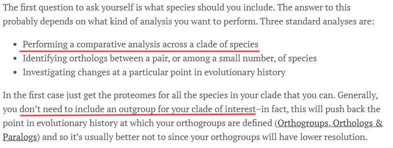
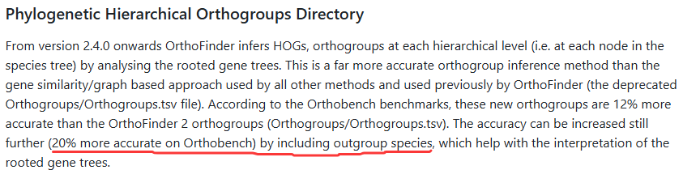
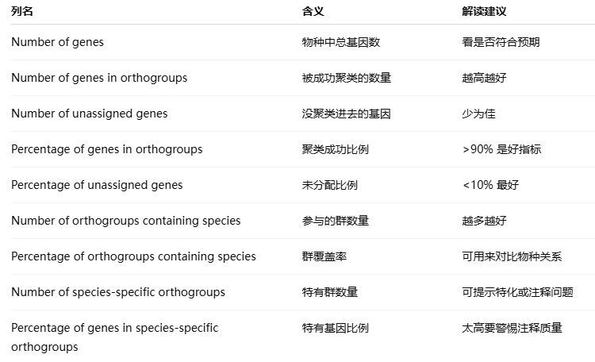

#### 相关文献
[@OrthoFinder\_ phylogenetic orthology inference for comparative genomics](../../../references/@OrthoFinder_%20phylogenetic%20orthology%20inference%20for%20comparative%20genomics.md)

#### GitHub地址
[OrthoFinder](https://github.com/davidemms/OrthoFinder)

#### Tutorial参考
https://davidemms.github.io/menu/tutorials.html
### 1. 安装
##### conda
```
conda install orthofinder -c bioconda
```
##### 安装包安装 
```
wget https://github.com/davidemms/OrthoFinder/releases/latest/download/OrthoFinder.tar.gz
tar xzvf OrthoFinder.tar.gz
cd OrthoFinder
```
> 注意配置环境变量方便全局使用

### 2. 输入与运行

#### 输入文件准备
- 输入文件一般为组装注释好的==蛋白文件==，一般可以直接从NCBI或者其它网站上下载，例如蔷薇科基因组的网站GDR。另外，下载后的文件==需要解压==，orthofinder只能识别“.fa”, “.faa”, “.fasta”, “.fas” or “.pep”结尾的文件。

- 类群选择，类群选择分多种情况讨论，针对一般的系统发育分析而言，取样尽可能==覆盖所有支系==。可以不用包括**外群**。

#### 运行 
```
gzip -d *.gz
orthofinder -f ExampleData/
#ExampleData为储存所有蛋白文件的目录
```

### 3. 结果解读与问题解析

  结果解读请参考GitHub主页有详细解释，或参考Tutorial的第3点，此处不予赘叙。

#### 问题解析
##### （1）筛选出的单拷贝基因较少
  GitHub中有提出类似问题[GitHub few single-copy orthologs](https://github.com/davidemms/OrthoFinder/issues/982)

  这里有几个可能会有所改善的建议：
1. 加入外类群，这可能和上述的类群选取建议相冲突但不妨一试。
2. 替换数据，原有数据导致筛选数量少的可能原因如下：
- **短板效应**，个别物种只筛选得到少量的单拷贝基因，导致整体共有的单拷贝也变少了。 
- **共祖重复基因过多**，可能由于某两个物种的最近共祖的重复基因太多，导致整体的单拷贝下降，此时除去其中一个物种会得到很大改善，且几乎不会影响结果。

>加入外类群可以提高直系同源基因筛选的准确度

#### 检查下列文件可以查看具体情况： 
##### **Comparative_Genomics_Statistics/Statistics_Overall.tsv**
记录了Orthofinder最终筛选出的正交群和单拷贝直系同源基因数量等信息

##### **Orthogroups/Orthogroups.GeneCount.tsv**
记录了参与Orthofinder的蛋白文件最终在每个正交群(OG)中含有多少基因序列，理论上来说，如果想要筛选出更多的单拷贝基因，则需要挑选**OG总量和只有单基因的OG总量多的类群**。此提取方法有对应脚本，位置在本人GitHub中的Tools/count_OG_per_species.sh。
##### **Comparative_Genomics_Statistics/Statistics_PerSpecies.tsv**
与Statistics_Overall.tsv类似，但是是针对单个物种而言
内容解释，来自chatGPT： 
通过这个结论我们可以简单的根据**短板效应**来判断一下哪些物种是需要被替换或去除的，至少满足以下两点：
- 首先成功聚类的基因数量要尽可能的多
- 其次特有的基因要尽可能的少
根据上述的判断标准，我们需要尽可能的筛选出哪些能够与其它物种一起筛选出更多单拷贝直系同源基因的物种。

##### **Comparative_Genomics_Statistics/OrthologuesStats_Total.tsv**
反映了每个物种对之间直系同源物的总数，不考虑拷贝数

---

## 相关文献链接

- [[@OrthoFinder_ phylogenetic orthology inference for comparative genomics]]
