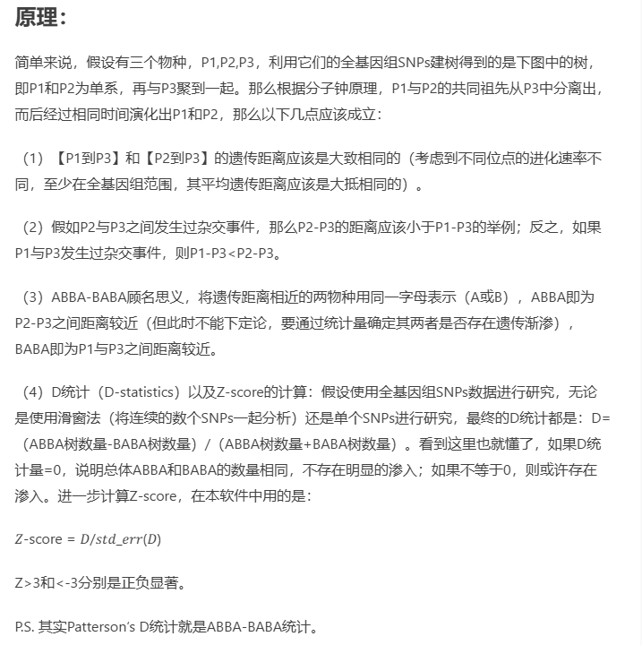
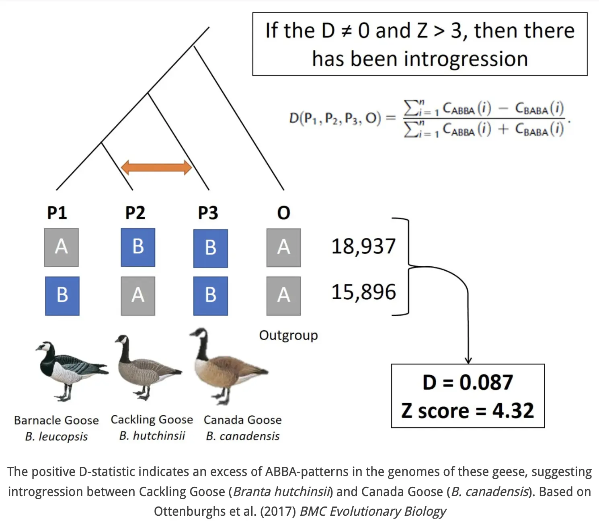
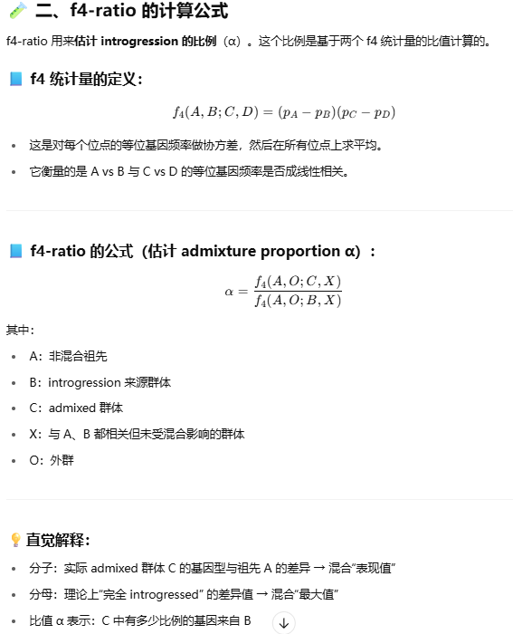
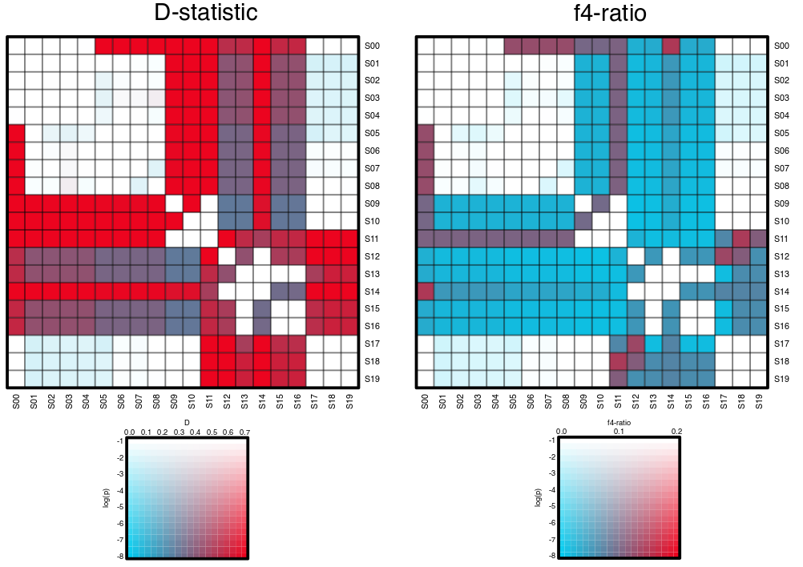
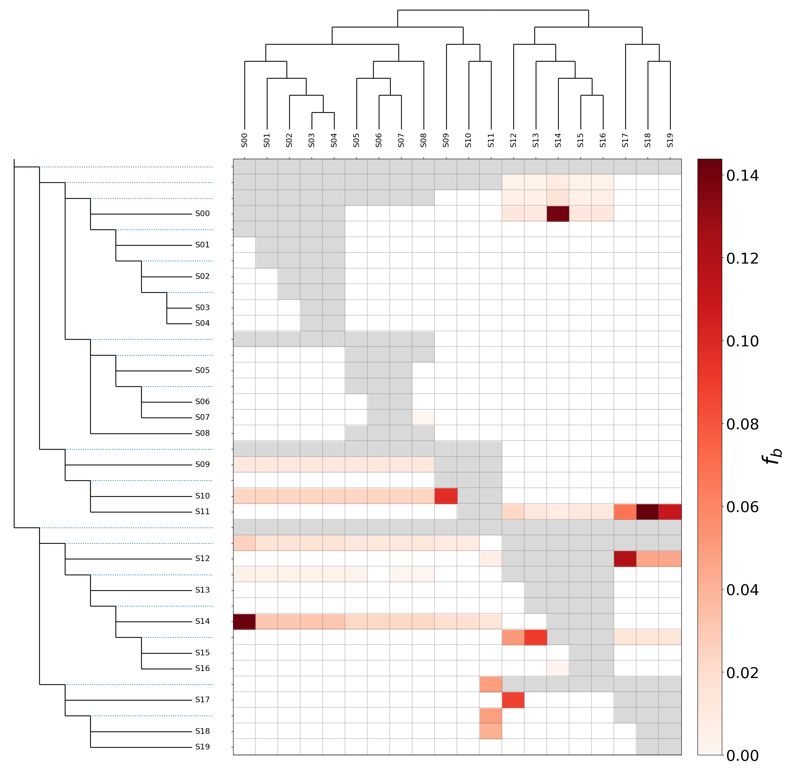

 ### 参考文献
[@Dsuite - Fast D-statistics and related admixture evidence from VCF files](../../../references/@Dsuite%20-%20Fast%20D-statistics%20and%20related%20admixture%20evidence%20from%20VCF%20files.md)

### GitHub地址
[D-statistics](https://github.com/mmatschiner/tutorials/blob/master/analysis_of_introgression_with_snp_data/README.md#painting)

### Dsuite
[Dsuite](https://github.com/millanek/Dsuite)

### SNP-sites
[SNP-sites](https://sanger-pathogens.github.io/snp-sites/)

## 1. 基本介绍
### 1.1 SNP的简要介绍
SNP全程single nucleotide polymorphism，即单核苷酸多态性，主要指个体在基因组水平上由于单个核苷酸的变异而引起的DNA序列的多态性。我们知道碱基有ATCG四种类型，所以理论上，SNP可以由2，3，4个等位基因组成。但实际上，SNP大多为2个等位基因，即所谓的二态性（biallelic SNP），其它的则称之为多态性（multiallelic SNP）。

[snp的二态性](https://www.cnblogs.com/bio-mary/p/14202672.html)
以人类基因组为例：
2个等位基因有4种不同类型:C→T(G→A)、C→A(G→T)、C→G(G→C)和T→A(A→T),在人类基因组中最为常见的是C→T(G→A), 其他3种类型的频率是相同的。
理解二态性，首先要明确SNP是指相对于同源染色体上相同位置的碱基变化，而人是二倍体，所以在一般的体内，存在非此即彼的基因型，举例：某SNP的基因型为(G/A),那么在人群中检测出的一对基因型只会是G/G,G/A,A/A，不会出现第三种碱基的改变；
那么为什么会出现这样的情况，SNP作为一种遗传标记，从人类出现之初就开始代代遗传下来，起初这只是一个突变，经过了自然选择后，部分突变稳定遗传了下来，所以SNP存在这样一个二态的特性。
当然，在NCBI数据库中，并不是所有的SNP都只有二态，也存在三态，四态的情况，除去数据上传有误，偶然的突变等原因外，一般是由于该片段的基因拷贝数异常导致的。
DNA上某位点本来是C ,但是突变成了T，那么这个有2种可能性碱基的位点就是二等位。举个例子，本来是纯合子，即C(G)/C(G)，但是一条染色体突变，变成了杂合子C(G)/T(A)，它有纯合子和杂合子两种状态，所以叫二态性（注：括号中是互补链，斜杠的左右表示同源染色体）
如果这个位点的C除了变成T，还可以变成G和A，那么这就是四等位。其实四等位也可以看做是一种复等位，人的ABO型血型系统就是典型的复等位基因控制。
从理论上来看每一个SNP 位点都可以有4 种不同的变异形式,但实际上发生的只有两种,即转换和颠换，也就是说，大多数情况下，C都是变成T，而变成A和G的概率很小，所以一般认为SNP是二等位的，或者是二态性。


同样的，在我们后续的分析中，Dsuite软件检测的SNP也是biallelic SNP，所以我们需要筛选的是二态的SNP。但是现在的问题是，snp-sites软件默认生成的VCF格式是多态的SNP。因此，如果我们使用snp-sites进行Dsuite分析，只有其中的二态位点会被用于渐渗分析。而当我们类群的数量上去的时候，多序列比对矩阵中相同位点的SNP就可能包含有更多的多态性位点。这个时候snp-sites生成的vcf文件就可能会出现信息量不足导致无法进行Dsuite分析的现象。因此，我们可以自己编写脚本，从多序列比对文件中抓取二态的SNP。
目前此脚本已经完成，储存在[msa2vcf_biallelic.py](https://github.com/XiongTor/Rosa_family/blob/main/Tools/msa2vcf_biallelic.py)


### 1.2  D-statistics简要介绍
**D-statistics**也称为**ABBA-BABA遗传渗入分析**，是通过全基因组的SNPs数据建树，并进行D统计来判断渐渗事件的一种方法。
我们可以直接参考简书的解释来理解其中的原理：



但是由于一些特殊情况的存在，以及统计的假设检验本身可能出现的假阳性情况，部分D值并不一定能够反映真实的情况，例如：
```
D_BBAA_noGF[which(D_BBAA_noGF$Dstatistic > 0.7),]
     P1  P2  P3 Dstatistic Z.score    p.value    f4.ratio   BBAA ABBA BABA
171 S18 S19 S00   1.000000 0.00000        NaN 7.42372e-06 179922  1.5    0
324 S18 S19 S01   1.000000 0.00000        NaN 7.42743e-06 179814  1.5    0
460 S18 S19 S02   1.000000 0.00000        NaN 7.39892e-06 179800  1.5    0
580 S18 S19 S03   1.000000 0.00000        NaN 7.43931e-06 179778  1.5    0
685 S18 S19 S04   1.000000 0.00000        NaN 7.44097e-06 179765  1.5    0
690 S06 S05 S11   0.833333 2.91667 0.00176897 4.94462e-05 138120 11.0    1
776 S18 S19 S05   1.000000 0.00000        NaN 7.43290e-06 179768  1.5    0
854 S18 S19 S06   1.000000 0.00000        NaN 7.44536e-06 179777  1.5    0
920 S18 S19 S07   1.000000 0.00000        NaN 7.42259e-06 179771  1.5    0
```
在上述表格中，我们可以看到D值非常的大，但是ABBA和BABA的值都比较小，说明在这些trios中ILS和IH的发生概率都很小。这时候D值的估计就明显出现了一个偏差。
同样得，在其中有一行P值是大于0.05的，这是由于，当我们假设H0为真时(p>0.05)，概率分布是呈现正态分布的，也就是说明这件事情有95%以上的概率为真，其中仍有5%可能为假，这就是假阳性的情况，是统计分析中本身存在的误差，哪怕通过BH等方法进行修正也还是会存在部分残留。因此后续还需要绘制==**f4比率图来估算基因流影响基因组的比率**==。
- D-statistics检测的是渐渗是否存在
- f4检测的是在特定trio中渐渗发生的比例
- 
### 2. 方法
主要使用Dsuite文件进行D统计量的计算，一般至少需要准备3个输入文件：
-  SNP calling中生成的VCF文件
-  sets.txt文件，每行代表一个物种和其所属种群的名称，外类群单独标明
-  物种树，可以带枝长，但并不计入到最后的运算中，但是带枝长可能会导致运行报错
#### 2.1 VCF文件
如果本身就是从事SNP的研究，并使用snp建树，直接使用生成的VCF文件即可。
如果只做D-statistics分析，这里建议使用**snp-sites**软件来生成VCF文件，具体操作见本人GitHub的D-statistics流程。
snp-sites从多序列比对的fasta文件中提取SNP，即可以使用**被子植物353**或**orthofinder的单拷贝直系同源基因**的超级矩阵作为输入文件，从中提取SNP并获得最终需要的VCF文件。且其运行速度十分快，3-10s可以从一个具有20类群353基因的超级矩阵中提取到SNP。

#### 2.2 Sets.txt文件
参考格式如下：
```
Ind1    Species1
Ind2    Species1
Ind3    Species2
Ind4    Species2
Ind5    Species3
Ind6    Outgroup
Ind7    Outgroup
Ind8    xxx
...     ...
IndN    Species_n
```

可以看到其中**外类群需要单独标注**

#### 2.3 运行
Dsuite的运行非常简洁，主要代码就一行，具体流程请参考本人GitHub代码部分
```
Dsuite Dtrios [OPTIONS] INPUT_FILE.vcf SETS.txt
```


### 3. 结果
#### 3.1 Dsuite的结果文件
首先我们需要明确的是，Dsuite在进行trio取样的时候是不考虑排序的，即不考虑ABC，ACB这样的排序。因此，最终计算出的D值是可能会有差异的。对此，Dsuite提供了3种排序的结果：
- \_BBAA.txt  排序满足出现概率最大的组合为BBAA组合，计算次要的两个组合的差值
- \_tree.txt     按照输入的系统发育树的拓扑来排序trio
- \_Dmin.txt   按照使得D值最小的排序方法来排序

#### 3.2 画图分析部分

根据想要展示的内容可以选择上述生成的3个文件中的一个来进行后续的分析和画图展示。
例如，以[analysis_of_introgression_with_snp_data](https://github.com/mmatschiner/tutorials/tree/master/analysis_of_introgression_with_snp_data)中的流程为例子，我们可以使用下列代码进行分析画图：
```
ruby plot_d.rb species_sets_with_geneflow_BBAA.txt plot_order.txt 0.7 species_sets_with_geneflow_BBAA_D.svg

ruby plot_f4ratio.rb species_sets_with_geneflow_BBAA.txt plot_order.txt 0.2 species_sets_with_geneflow_BBAA_f4ratio.svg

#其中的0.7和0.2分别指的是各自图例的D值和f4值的范围为0-0.7和0-0.2
另外图的长宽大小需要到plot_d.rb和plot_f4ratio.rb中修改原代码，没有对应的参数在命令行中直接调整

#图中，红色代表渐渗相对严重，蓝色代表渐渗相对较弱。颜色越深代表约显著，颜色越浅代表越不显著。
```



那么现在有一个问题是，我们可以根据这样的结果得知基因流发生在哪些物种之中吗。显然是可以的，但是不一定足够准确。我们设想一种情况，即A物种和其姐妹枝的祖先种存在基因流，那么显然A物种与其姐妹枝下的所有物种都会检测出这种基因流的现象。即多个显著的f4-ratio结果可能都是由同一个基因流事件导致的。
那么这时候我们可以使用在f4-ratio基础上升级的另一套检测方法**f-branch(fb)**，它可以把最终f4-ratio的结果整合到整个物种树上，包括其内部分支也会被纳入到检测范围之内。显而易见的，最终的输入文件应该是 \_tree.txt文件，示例代码如下：
```
Dsuite Fbranch simulated_tree_with_geneflow.nwk species_sets_with_geneflow_tree.txt > species_sets_with_geneflow_Fbranch.txt

python3 /Users/milanmalinsky/Sanger_work/Dsuite/Dsuite/utils/dtools.py species_sets_with_geneflow_Fbranch.txt simulated_tree_with_geneflow.nwk
```

### 4. 其它与讨论
在除了常规的渐渗分析之外，D-statistics还可以用于一些其它更加仔细的分析。比如利用基因组的数据探究物种某一性状是**独立起源还是由于基因交流**导致的。

---

## 相关文献链接

- [[@Dsuite - Fast D-statistics and related admixture evidence from VCF files]]
