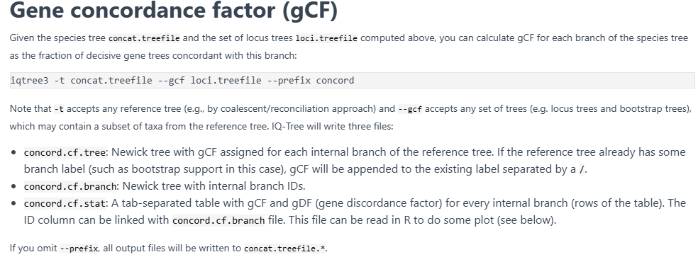

### 参考文献与方法：
[@The perfect storm\_ gene tree estimation error, incomplete lineage sorting, and ancient gene flow explain the most recalcitrant ancient angiosperm clade, malpighiales](../../../references/@The%20perfect%20storm_%20gene%20tree%20estimation%20error,%20incomplete%20lineage%20sorting,%20and%20ancient%20gene%20flow%20explain%20the%20most%20recalcitrant%20ancient%20angiosperm%20clade,%20malpighiales.md)

GitHub教程
[GitHub_tutorial](https://github.com/lmcai/Coalescent_simulation_and_gene_flow_detection)

本人GitHub主页，记录了相关代码：
[XiongTor](https://github.com/XiongTor/Rosa_family)
同时在 VS code对应的code仓库中也存有相关代码，与简要的readme说明，后续阅读请结合使用
# 1. 简要介绍
随着基因组规模的不断增大，构建的系统发育树会具有更加强力的支持，与此同时也会造成强烈的冲突。因此我们需要判断造成这个冲突的来源是什么，以及如何消弭这种冲突的来源。
一般来讲这种冲突主要来源于以下几个方面：
- ILS，不完全谱系分选
- GTEE，基因树评估错误
- IH，渐渗杂交
- HGT，水平基因转移
#### ILS (Incomplete Lineage Sorting)
不完全谱系分选，官方解释为祖先基因多态性在后代中随机保留而导致的单个基因位点的系统发生关系与真实的进化历史不一致的现象，在快速的辐射适应中尤为常见。在具体分析中又呈现另一个十分显著的特征，即基因在物种分化前还未能完成共组，导致其在后续可能随机流向不同的物种。换句话说就是基因的分化时间远远早于物种的分化时间。因此也可以通过检测与物种树不一致的基因树中的短内部枝长来评估ILS的发生程度。
- 基因多态性与随机保留
- 常见于快速辐射现象
- 不一致基因树中的短内部枝长

#### GTEE (Gene Tree Estimation Error)
基因树评估错误，这类误差一般是技术型误差，主要是由于一些非生物因素导致的。包括但不限于。
- 信息位点过少，一般特征为短序列或低变异率，过保守的序列，但具体还是看信息位点数量，或许可以通过SNP衡量???
- 系统发育噪音，变异率太高，不保守的序列
- 比对错误，过滤错误，模型选择错误等
为了避免这类错误，要求前期做数据清理的时候要尽可能的全面且严谨，避免比对错误，清理错误，低信息位点和长枝干扰等。

#### IH (Introgressive hybridization)
渐渗杂交，顾名思义，是物种之间通过杂交带来的基因交流的现象。此类现象一般还未形成新的杂交物种，当使用杂交区域片段建树的时候会导致与物种树之间的差异。与ILS相反，这类杂交基因分化的时间一般晚于物种分化的时间，所以一般会形成一段较长的内部枝长。

#### HGT (Horizontal Gene Transfer)
水平基因转移，指遗传物质在不同物种之间的转移。通常此类事件发生在原核生物之间比较多。植物中主要通过病毒感染和寄生来发生，一般比较少见。动物之间缺乏强证据。因此一般不考虑HGT对植物系统发育的影响。


# 2. 方法
检测的主要目的是探究基因树的不一致或者说**基因树的变异程度**主要是由于哪种生物因素导致的。会测试**ILS**，**GTEE**，**IH**各自对基因树变异的相对贡献度是多少。
代码流程参考本人的GitHub仓库：[ILS_GTEE_IH.SH](https://github.com/XiongTor/Rosa_family/blob/main/Analysis/ILS/ILS_GTEE_IH/ILS_GTEE_IH.SH)

### 输入文件要求：
- 置根的来源于溯祖法的最佳物种树
- 置根的bootstrap的物种树，要求溯祖法 (例如：用IQTREE建立基因树时，根据参数`-B`的大小，会生成若干个bootstrap树，将每一个基因树的对应bootstrap树使用ASTRAL推算物种树即可获得)
- 置根的基因树

**输入文件准备好后，从以下四个方面开展分析：**
#### 1）基因树变异程度
表示的是基因树的拓扑结构在物种树上的变异程度，也就是不同基因树在每个节点上支持的拓扑是否一致。
一般是使用**gCF**(gene Concordance Factor)值来衡量，我们可以直接在IQTREE中找到该方法来进行运算，一般需要一棵物种树和一个基因树的集合。一般来讲，在时间充足的情况下，选择bootstrap tree的集合来作为输入，这样能够提高样本量，减小误差。

```bash
iqtree -t rosa_orthofinder_MO_treeshrink_sp_rt_oneoutg_nonodelabel_nozero_final.tre --gcf BSgenetree.trees --prefix concord

#BSgenetree.trees is the bootstrap gene trees.exampled, if you have 20 genes, you will have 20 x 100 bootstrap gene trees assuming you conducted 100 replicates.

#Final result:

concord.cf.stat
```
#### 基因树评估错误---GTEE
我们评估GTEE的主要思路是比较模拟数据建立的基因树与物种树之间的差异。使用模拟数据主要是出于GTEE本身的属性考量的。GTEE本身是一种系统误差，它与生物学因素，例如ILS和IH不同，它主要是**由于模型/方法本身的误差导致的**。所以当我们用原本经验数据集得到的基因树去与物种树比较的话，我们就无法得知这到底是模型的原因还是一些生物学因素的原因。
换言之，用模拟数据评估GTEE就是看在理想条件下用当前方法建树有多准确的指标，它揭示的是方法自身的限制，而不是你真实数据中的偏差。

具体方法上，本人主要采用[seq-gen](https://github.com/rambaut/Seq-Gen)程序进行序列的模拟，在运行的过程中需要注意以下几点：
- 输入的物种树需要有枝长且不为0，可以没有支持率，根据目前测试的结果，直接使用ASTRAL的物种树来模拟的话，可能会导致最后生成的模拟序列变异度不够，导致最后建树失败。因此可以考虑使用序列重新估算枝长后再输入
- 类群较少，枝长短，序列短的类群，在模拟上可能会出现，不同物种之间序列一模一样的情况，这时候建议阅读seq-gen的参数信息，增加序列的变异程度，可能会有部分改善
- seq-gen的模拟序列是可以重复的，所以注意保留日志文件或记录好随机种子
- 模拟不同的基因需要提供不同的替换速率，这部分信息可以在使用分区文件进行串联法估算枝长的时候得到。或者直接在串联法建树中得到，是一样的
```bash
=============================  使用超矩阵中的碱基替换速率作为seq-gen的参数输入  ===========================
# 运行已经写好的脚本辅助
# generate_pipeline.sh 读取分区文件抓取出每个基因分区的替换速率，然后自动生成需要运行的seq-gen命令，当然模拟序列的长度可以通过分区文件调整成与实际基因相同的长度，也可以直接指定一个固定的长度(大多数文献的做法)
# clip_missing_taxa.sh 如果需要调整对应的模拟基因的物种数量也与实际的一致，可以尝试使用这个脚本。要求提供对应的基因树文件，可以阅读该脚本，在开头写有备注，此脚本存在服务器和VS CODE对应的库中

bash generate_pipeline.sh
bash run_seq_gen.sh

=============================  使用每个单基因的碱基替换速率作为seq-gen的参数输入(最终使用) ===========================
# 从 IQ-TREE 的 .iqtree 文件中提取替代模型参数，生成 Seq-Gen 模拟命令,注意替换路径
python generate_seqgen_commands.py
# 生成文件 seqgen_commands.sh，后续可以直接运行，同时如果想要替换不同的物种树，可以直接替换
bash seqgen_commands.sh

# 同时注意，生成的模拟序列中的物种为全部物种，但是实际情况中，不同基因的物种数量不一，所以需要提取部分序列
bash clip_missing_taxa.sh

# 并行跑iqtree
ls ./*.fasta | parallel -j 3 --bar \
    'iqtree -s {} \
            -m MFP \
            -B 1000 --bnni \
            -T 10'
```
在模拟完序列并采用与之前建立基因树相同的方法建立完基因树后，需要与物种树进行比较，看物种树的各个节点有多少被准确恢复了，具体代码如下：
```bash
raxmlHPC -f b -t species.tre -z sim_gene.trees -m GTRGAMMA -n ERR

# 如果你的每个基因并不包含有全部的物种，可以使用下列脚本
astral4 -C -c rosa_orthofinder_sptree_rebranch_rt_oneoutgroup.tre \
  -u 2 \
  -o GTEE_scored.tre \
  sim_genetrees.tre
 
python transform_astral_q1_result.py


```

>理论上来讲，应该也可以用IQTREE的gcf的方法来计算这个节点的恢复率，但是此处并没有做这种尝试，姑且保留这个问题在这里。

**同样的，当溯祖法和串联法存在冲突的时候，我们是否可以考虑使用模拟数据计算GTEE来评估到底那种方法导致的GTEE更低，从而认为此种方法最终获得的拓扑更加的可靠**


#### 不完全谱系分选---ILS
ILS的评估标准主要是计算theta值

theta=序列重新估算后的内部枝长/ASTRAL模型评估的内部枝长

重新估算的枝长，反映的是碱基替换速率或者说突变率，枝长越长表示变异率越高，谱系差异越大，约可能与ILS有关。
ASTRAL的溯祖枝长，反映的是谱系间的分化距离，枝长越短表示越难以区分，ILS概率更高。
所以我们可以看出theta值越大，ILS发生的概率越大。
>可以与QuIBL的方法联合起来比较，感觉这个概念目前不是很让人信服。可以再深入了解一下ASTRAL的枝长和序列重新估算的枝长到底各自是什么意义

#### 基因渐渗与杂交---IH

采用的方法与QuIBL和MSCquartet很相似，都是比较三联体出现的频率，及在不同的基因树种，由三个物种组成的三种不同的拓扑结构的出现频率是多少。
但是不一样的是，在此方法中使用了模拟数据，通过计算基因树中三联体的频率和模拟树中三联体的频率，只有当次要拓扑和第三拓扑出现评论的差值超过了模拟数据中的这种差值的最大值才会被认为是发生了IH。因此可能会更加严谨一点，建议与**MSCquartet和QuIBL**进行一下比较
```bash
mkdir geneTr_sim

Rscript --vanilla ../script/MSC_geneTr_simulator.R $speciesTr $speciesTr_BP $geneTr

rm geneTr_sim/*.tem.genetrees


# reroot
for n in $(seq 1 100);do
  echo "======== BP${n}.sim.genetrees ========"
  for i in $(seq 1 2063); do
    sed -n "${i}p" BP${n}.sim.genetrees>test.tre
    pxrr -t test.tre -g Outgroup > test_rt.tre
    cat test_rt.tre>>BP${n}.sim_rt.genetrees
  done
done  

#excepted result: sets of simulated gene trees in the folder geneTr_sim


# Count triplet frequency in empirical gene trees and simulated gene trees

# This can take hours if there are >30 species, so it is strongly advised to distribute the work to the cluster. For example, submit a job to count triplet frequency for one set of gene trees.
  

# For empirical gene trees

python ./script/triple_frequency_counter.py $geneTr $speciesTr

#excepted result: *.trp.tsv

#format: column1--species names of the triplet, sorted alphabetically; column2--triplet frequencies of (sp1,sp2);column3--triplet frequencies of (sp1,sp3);column4--triplet frequencies of (sp2,sp3).

  
# For simulated gene trees

# If the server hace enough cpu source, you can use parallel to speed up the process.

# !!!! Note, do not use the "./BP.sim.genetrees" as the input, remove the "./", just use "BP.sim.genetrees" is ok. !!!!

ls ./*_rt.genetrees | xargs -I{} echo "../geneTr_sim/{}" > BP_sim.rt.genetrees.txt

cat BP_sim.rt.genetrees.txt |parallel -j 30 'python ../script/triple_frequency_counter.py {} ../rosa_orthofinder_MO_treeshrink_sp_rt_oneoutg_final.tre'


# Find significantly unbalanced triplets and map to species tree

# !!! The GitHub orgin script is wrong, the input file should be the genetrees,not the species tree. You can check the `find_unbalanced_triplets.py`

python /data/xiongtao/tree/ILS/gene_flow/gene_flow_analy/script/find_unbalanced_triplets.py $geneTr


mv unbalanced.trp.tsv

#result in unbalanced.trp.tsv

python /data/xiongtao/tree/ILS/gene_flow/gene_flow_analy/script/triplet_mapper.py $speciesTr unbalanced.trp.tsv

#result in unbalanced_triples_raw_count.tre and unbalanced_triples_perc_reticulation_index.tre

### IH/Gene flow

Rscript ~/data/scripts/ILS_GTEE_IH/get_node_inf.R unbalanced_triples_perc_reticulation_index.tre

```

### 汇总全部结果并绘图
可以收集所有的得到的树文件，然后通过下面的脚本进行汇总并绘图
```bash
# 需要更改python脚本中的文件路径，记得替换后再运行
# 标注的use_theta 和without_theta意思是ILS水平评估的时候，是否计算theta值，可以看脚本了解详情
python extract_node_values_theta.py use_theta
python extract_node_values_without_theta.py without_theta

# 开始绘图
Rscript relaimpo.R relative_contribution_ILS_Err_Intro_count_use_theta.csv use_theta
Rscript relaimpo.R relative_contribution_ILS_Err_Intro_count_without_theta.csv without_theta
```
### 3. 其它
主要是想要讨论一下方法本身存在的一定的局限性，主要涉及以下几点，纯个人看法：
1）部分方法的可靠性，例如ILS的评估方法是否可靠
2）模拟数据的随机性，模拟的数据随着随机种子的不同会出现不同的情况，那么是否会对最终结果产生影响？可以考虑做多次重复看看是否对最终结果有影响
3）基于seq-gen的情况，如果研究的类群较小，亲缘关系较近，ASTRAL的枝长出现较多0或估计不准的话，似乎会对于最终结果产生影响，甚至可能由于本身数据的问题导致无法运行(有效数据太少)。
4）前期的数据最好处理的干净一些，不然可能会导致GTEE评估过大，但GTEE评估过大也可能是数据本身难以被模型拟合，哪怕已经是最佳模型了。

---

## 相关文献链接

- [[@The perfect storm_ gene tree estimation error, incomplete lineage sorting, and ancient gene flow explain the most recalcitrant ancient angiosperm clade, malpighiales]]
- [[@The perfect storm_ Gene tree estimation error, incomplete lineage sorting, and ancient gene flow explain the most recalcitrant ancient angiosperm clade, malpighiales_2021]]
