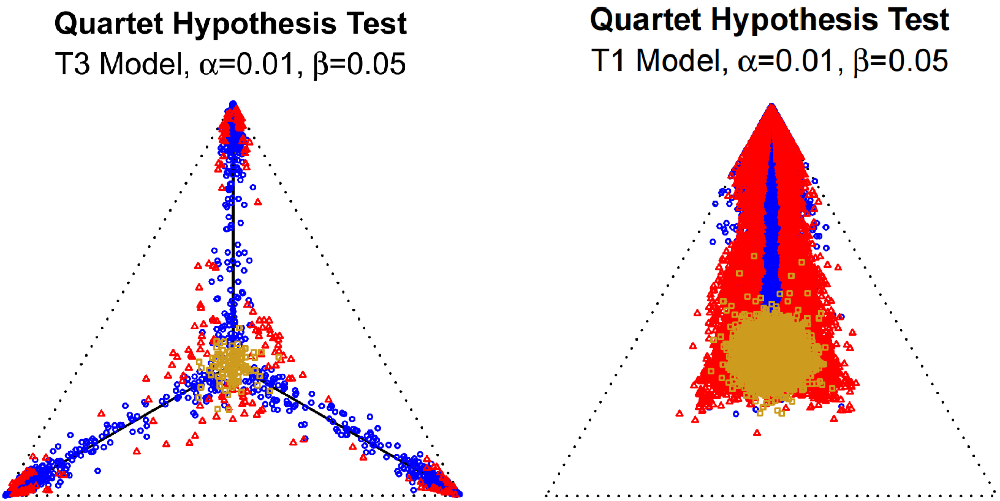

## 生物学问题
### 一. 核质冲突
母系遗传导致
### 二. 物种树与基因树冲突
[[../../../references/@Gene tree discord, simplex plots, and statistical tests under the coalescent]]
#### 1. 基因树评估错误（gene tree inference error）
- 序列太短
- 模型拟合效果差
- 无模型重组
#### 2. 不完全谱系筛选（incomplete lineage sorting）
#### 3. 杂交和基因渐渗

## 方法一：MSCquartets(杂交，ILS，基因渐渗)

![[../../../imag/MSCquartets/file-20250504170944178.png]]
msc方法研究的最小单元为一个具有4个tips的unroot tree，该单元为NANUQ方法推断网状结构所需要的，此图反映的是杂交或不完全谱系筛选导致的基因树与物种树之间的冲突

>问题：为什么要使用这个4tips的结构而不是使用3tip的结构，此处可以呼应另一篇文献：[[../../../references/@The perfect storm_ gene tree estimation error, incomplete lineage sorting, and ancient gene flow explain the most recalcitrant ancient angiosperm clade, malpighiales]]

其它相关的软件：
- [[PhyloNet]]
- [[SNaQ]]
- [[Beast]]
![[../../../imag/MSCquartets/file-20250504173459722.png]]

不同的四分类型对应的生物学情况：
- 注意star tree 的表述可能具有一定问题
![[../../../imag/MSCquartets/file-20250504174008934.png]]

## 2.如何开展计算

**通过计算不同拓扑的基因树的占比来计算qcCF值** 
![[../../../imag/MSCquartets/file-20250504173840356.png]]

**将点映射到一个三维的坐标系中，可以看到它的分布情况**
![[../../../imag/MSCquartets/file-20250504174326761.png]]

**不同的分布情况对应了不同的树的结构，以及可能的杂交**
![[../../../imag/MSCquartets/file-20250504174403525.png]]

**设置H0假设**
![[../../../imag/MSCquartets/file-20250504175435650.png]]

**设置不同的α和β值来限制假设成立与否的严苛程度，需要注意的是与一般的统计学*p* 检验结果不同，不能以简单的0.05来套用α值，该值是可以变动的，认为当我们的α值设置的越大，则越可能检测出杂交，具体数值的大小请参考文献或者运行的代码**
![[../../../imag/MSCquartets/file-20250504180529324.png]]
>问题：靠近三角形中心的点是什么意思，点如果分布在此周围可能存在一定问题，具体讨论请查看reference中的视频

**网状结果的查看与人工解释，需要人工的去查看哪些存在cycle的取样，并将他们解释为不同的情况**
![[../../../imag/MSCquartets/file-20250504180743238.png]]

![[../../../imag/MSCquartets/file-20250504180758257.png]]

>问题：得到结果后如何解释，如何得到更加详细的结果，例如，哪些类群之间存在杂交，ILS或基因渐渗

# 结果解读

不同颜色点的含义如下：
蓝色：没有拒绝MSC树假设，拒绝星状模型。与物种树一致，同时枝长正常。  
黄色：没有拒绝MSC树假设，没有拒绝星状模型。与物种树一致，但是枝长极短，一般认为是ILS造成的。
红色：拒绝MSC模型，拒绝星状假设。与物种树不一致，同时枝长正常，一般认为是杂交或者其它系统误差导致的。
绿色：拒绝MSC模型，没有拒绝星状假设。与物种树不一致，但是枝长极短。也可能是ILS导致的。一般占比少。

首先，三个顶点依次对应：
- **顶部顶点 (top)**: `12|34` - 完全支持第一种拓扑
- **左下角顶点 (left)**: `13|24` - 完全支持第二种拓扑
- **右下角顶点 (right)**: `14|23` - 完全支持第三种拓扑
## 代码教程：  
本人代码：
[xiong]()(https://github.com/XiongTor/Rosa_family/blob/main/Analysis/ILS/MSCquartets.R)
其它教程：
[B站](https://www.bilibili.com/read/cv39605952/?spm_id_from=333.1387.0.0&opus_fallback=1)
[简书](https://www.jianshu.com/p/7de4ae9a3160)
## Reference
[[../../../references/@GetOrganelle_ a fast and versatile toolkit for accurate de novo assembly of organelle genomes]]

原作者在YouTube上的讲解
[[@Phyloseminar #116_ john rhodes (university of alaska)]]

---

## 相关文献链接

- [[@Gene tree discord, simplex plots, and statistical tests under the coalescent]]
- [[@GetOrganelle_ a fast and versatile toolkit for accurate de novo assembly of organelle genomes]]
- [[@Phyloseminar #116_ john rhodes (university of alaska)]]
- [[@The perfect storm_ gene tree estimation error, incomplete lineage sorting, and ancient gene flow explain the most recalcitrant ancient angiosperm clade, malpighiales]]
- [[@The perfect storm_ Gene tree estimation error, incomplete lineage sorting, and ancient gene flow explain the most recalcitrant ancient angiosperm clade, malpighiales_2021]]
