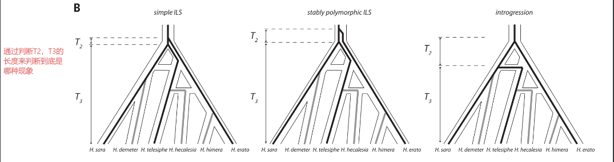
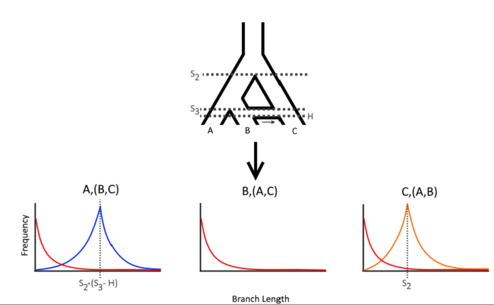
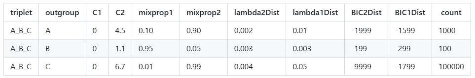

####  相关文献：
[@Genomic architecture and introgression shape a butterfly radiation](../../../references/@Genomic%20architecture%20and%20introgression%20shape%20a%20butterfly%20radiation.md)

## 简要介绍
QulBL最早发表于2019年的science文章，[@Genomic architecture and introgression shape a butterfly radiation](../../../references/@Genomic%20architecture%20and%20introgression%20shape%20a%20butterfly%20radiation.md)，用于研究蝴蝶中的基因交流现象。基本原理是通过计算由3个tips组成的subtrees结构中枝长的长短来判断该结构中ILS和基因流发生的概率，要点如下：
- ILS中基因分化时间早于物种分化时间，所以以基因分化的视角来看，3个物种在较短的时间内同时出现，在系统发育树上表现为一个较短的内部枝长。以下图为例，即T2应该明显短于T3。在统计上若干三联体的枝长呈现一个**指数级分布**。
- 基因渐渗一般发生在物种形成之后。祖先基因在首次分化之后，间隔了较长的一段时间才发生了二次分化。在系统发育树上表现为一个较长的内部枝长。即渐渗的T2应该显著长于ILS的T2。在统计上若干三联体的枝长呈现一个**类正态分布**



## 方法流程

#### 1. 安装
要求python2.7的环境，所以先创建环境
```
conda create -n python2.7 python=2.7
conda activate python2.7
```
同时需要安装特定版本的依赖包
```
conda install ete3==3.0.0b35  
conda install joblib==0.11
```
通过运行示例文件来判断是否配置成功
```
python QuIBL.py ./Small_Test_Example/sampleInputFile.txt
```

#### 2. 输入文件
QulBL运行较为简单，只需要准备两个文件
- 置根后的基因树合并文件，smallTestTrees.txt
- 配置文件，sampleInputFile.txt

配置文件示例如下：
```
[Input]
treefile: /genetrees.nwk
numdistributions: 2
likelihoodthresh: 0.01
numsteps: 30
gradascentscalar: 0.5
totaloutgroup: outgroup_tip
multiproc: True
maxcores:48

[Output]
OutputPath: ./res.csv
```

相关参数解释如下，一般使用默认参数就好，需要变动的主要参数为`treefile` 和`totaloutgroup`
```
treefile: The path to the trees to be analyzed.  
  
numdistributions: The number of branch length distributions in the mixture to test. For now, only two is supported (this corresponds to one ILS and one non-ILS distribution).  
  
likelihoodthresh: The maximum change in likelihood allowed for the gradient ascent search for theta to stop.  
  
numsteps: The number of total EM steps. For thousands of trees, we reccomend trying around 50.  
  
gradascentscalar: The factor to shrink the stepsize when a gradient ascent step fails.  
  
totaloutgroup: The name of the ultimate outrgroup of your sample. All trees are assumed to be rooted using this taxon.  
  
multiproc: Accepts `True` or `False` and either turns multiprocessing on or off.  
  
OutputPath: Where the output gets written.  
  
maxcores: The maximum number of cores QuIBL is allowed to use.
```

**基因树文件**，建议基因树的tips label不要带下划线“\_“，因为最终结果中会以下划线来分隔每个三分的物种，容易造成混淆。同时**值得注意的是基因树文件配置有两条思路，分别对应不同的情况**

  1）基因树文件中**不存在样本缺失**，所有的基因树都包含所有的取样，此时只需要直接运行如下代码即可：
```
python /QuIBL-master/QuIBL.py sampleInputFile.txt
```

  2）基因树文件中**存在样本缺失**，此时流程较为复杂，需要通过提取子树来避免有样本缺失的问题，流程如下：
  涉及到如下几个主要步骤：
  - 01_comb_4spes.py，通过物种树来提取所有可能的三物种组合
  - 02_extract_subtree_for_4spes.py，抽取所有的四物种组合树，多出的一个物种为外类群
  - 去除祖先节点序号，生成配置文件sampleInputFile.txt
  - 批量运行QulBL并合并全部结果

  具体代码流程如下：
**01_comb_4spes.py**
```
  # coding=utf-8
from itertools import combinations
from ete3 import Tree
# 给定的元素
elements = ['aawi', 'acer', 'acyt', 'adig', 'aflo', 'ahya', 'aint', 'amic', 'amil', 'amur', 'anas', 'apal', 'asel', 'aten', 'ayon']

# 提取三个元素为一组
combs_3 = list(combinations(elements, 3))

# 每组加上'outgroup'形成四个元素
combs_4 = [(comb[0], comb[1], comb[2], 'outgroup') for comb in combs_3]

# 将每个组合写入文件中，每行一个组合
with open('out_four_species_array.txt', 'w') as file:
        for comb in combs_4:
                file.write(' '.join(comb) + '\n')
```

**02_extract_subtree_for_4spes.py**
```
# coding=utf-8
from ete3 import Tree

file_path = 'out_four_species_array.txt'
b = 1

with open(file_path, 'r') as file:
    # 逐行读取四物种组合
    for line in file:
        subtree_taxa = line.strip().split(' ')
        result_array = []

        # 打开树文件
        with open('alltree.rooted.txt', 'r') as treefile:
            for treeline in treefile:
                t = Tree(treeline)

                # 获取该树的所有叶子名
                leaf_names = set(t.get_leaf_names())

                # 如果当前组合不完全包含在树中，跳过
                if not all(tip in leaf_names for tip in subtree_taxa):
                    continue

                # 提取子树
                t.prune(subtree_taxa, preserve_branch_length=True)
                a = t.write()
                result_array.append(a)

        # 如果有提取到子树，写入文件
        if result_array:
            filename = "out_subtree_" + str(b) + ".txt"
            with open(filename, 'w') as outfile:
                for element in result_array:
                    outfile.write(element + '\n')
            b += 1

```

产生多个4物种组合的基因树文件，对其进行处理，将祖先节点的序号去掉
```
sed -i 's/)\([0-9]*\):/):/g' out_subtree_*
```

批量产生sampleInputFile.txt文件，注意修改路径和outgroup：
```
for file in out_subtree*; do
  echo -e "[Input]\n\
treefile: ../02-four-sp-array/$file\n\
numdistributions: 2\n\
likelihoodthresh: 0.01\n\
numsteps: 50\n\
gradascentscalar: 0.5\n\
totaloutgroup: mcap\n\
multiproc: True\n\
maxcores:70\n\
\n\
[Output]\n\
OutputPath: ./out${file}.csv\n" > ./run_${file}
done

```

**03_run.sh**，批量运行脚本
```
#构建批量运行的sh文件03_run.sh  
for file in `ls run_out_subtree*`;do 
  echo -e "python ~/data/software/QuIBL-master/QuIBL.py ../02-four-sp-array/$file";
done > ../03-run/03_run.sh  
  
#利用Parafly并行跑程序，该软件在python2和python3环境下均可以利用conda安装,注意调整CPU占用量
nohup ParaFly -c ./03_run.sh -CPU 20 &
```

最终结果整合：
```
for file in *.csv; do 
  sed -n '2,$p' "$file" >> results_qulbl.txt; 
done

sed -i '1i triplet,outgroup,C1,C2,mixprop1,mixprop2,lambda2Dist,lambda1Dist,BIC2Dist,BIC1Dist,count' results_qulbl.txt
```

#### 3. 常见报错
```
ValueError: math domain error
```

这个报错是由于`L+=log(temp)`中temp值的异常导致的数学运算错误。往上追溯会发现temp的异常是`cArray=[nan, nan], lmbd=nan`中的NAN导致的无法识别。NAN的异常又是由于脚本中在进行EM拟合时步长调节过度导致的，即在规定的步数内，步长太长跳过了最优值导致最终的λ发散或为负数而显示的异常。虽然代码中已有相关调节措施避免此类情况，但显然还是存在一定的bug。
> EM 拟合的目标就是用混合分布模型，最大限度解释输入的分支长度数据，并估计这些数据是由 ILS 和 introgression 以何种比例产生的。

因此我们目前有两种思路去规避这个报错：
1)  调参，调节参数避免出现这种问题
2)  编译cython后使用作者的另一个脚本运行

##### 1) 调参
- 减小`gradascentscalar`，这是控制 λ（`lmbd`）变化速度的因子，减小它能有效避免步长太大导致 λ 趋近 0 或负数，从而触发 `NaN`
- 提高 `likelihoodthresh`，减少陷入“震荡”区域的迭代次数
- 增加 `numsteps`，增加调节次数去避免`NAN` 
值得注意的是，调节参数本身具有一定效果但不一定能完全适配所有数据。同时调参后会导致运行时间延长，也可能造成其它报错

##### 2) cython编译
作者提供了cython编译的另一个类似脚本可以解决上述报错，流程如下：
值得注意的是，使用cython编译的QuIBL_cyth.py脚本，最终会把带有外类群的组合也输出到结果中，导致最终会有4个不同的组合，但是只使用一般的QuIBL.py脚本只会输出除外类群外的一种组合。这个时候可以去掉带有外类群的结果，也可以不去除，影响较小。

在创建的python2.7的环境下安装cython
```
conda install cython
```

编译cython，在下载的QulBL的安装文件中有帮助实现编译的文件，位置在`QulBL/cython_vers/setup.py`，同样的新的QulBL脚本也在该目录下，编译代码如下：
```
python setup.py build_ext --inplace
```

编译完成后使用新的脚本`QuIBL_cyth.py`运行那些不能正常跑出结果的文件即可，示例如下：
```
python QuIBL_cyth.py run.txt
```
#### 4. 结果展示与画图

让我们来简单分析一下最终结果，即你汇总的`results_qulbl.txt`文件中的结果。以下是GitHub中的一个例子，其物种树的拓扑为：(((A,B),C),D);

```
triplet：所分析的三联体结构
outgroup：以哪个tip为外群
C1：仅ILS模型下分支的内部枝长，默认为0
C2：双分布模型下的内部枝长，如果拓扑与物种树一致，反映两次物种分化事件之间的时间间隔。如果不一致，反映的是渗入事件与所有三个分支共祖之间的时间间隔
mixprop1：ILS发生的概率比例
mixprop2：渗入事件发生的概率比例
lambda1Dist：仅ILS模型下的拓扑枝长缩放比例，可以理解为标准化枝长使得它可以用于检测ILS和渐渗
lambda2Dist：同上，但是双模型
BIC1Dist：仅ILS模型下的贝叶斯得分,通常 BIC 差值 >10 被认为显著支持
BIC2Dist：混合模型下的贝叶斯得分，越小越好
count：此拓扑在输入的所有拓扑中出现的次数
```
>部分解释可能存疑，如C1/2和lambda的解释

根据如上解释，我们可以发现，当C为外类群时，拓扑与物种树一致，此时判断基因树物种树一致，不参与总体的ILS/渐渗的测评中。即我们认为对于所有位点而言，有0.9\*1000/(1000+100+10000)=0.89%的位点是由于渐渗导致的物种树与基因树不一致，而只考虑与物种树不一致的位点的话，这个概率来到了81%


##### 结论解释中的部分难点

1）如何计算两个物种间的渐渗概率，基于此需了解以下几点
- 两个物种广泛存在于不同的三联体中，如何计算这两个物种间的渐渗概率，教程中的两种算法最终得出的结果有哪些区别
- 是否考虑概率计算是基于哪个模型（ILS混合还是仅ILS）做出的
- 是否考虑显著性 

2）如何得出不同三联体的内部枝长分布频率
- 数值如何计算 √
- 如何根据数据直方图拟合出两种模型的最适曲线  √

3）ILS的概率如何计算
- 是否可以基于渐渗的算法直接替换


# 深化研究
#### 1. 对比“物种树一致的基因树”与“冲突的基因树”的内部支长分布。如果两者在 QuIBL 估计下的 $2N_e$ 转换值非常接近，说明 ILS 是主导因素。
#### 2. 观察 IH 信号的 $\Delta BIC$ 值。如果大部分 $\Delta BIC$ 很小（例如 < 10），倾向于认为冲突是由 ILS 驱动的。
### 3. 统计内部枝长的ILS和IH的概率分别是多少
### 4. 统计每一个基因的ILS贡献度和IH概率

---

## 相关文献链接

- [[@Genomic architecture and introgression shape a butterfly radiation]]
