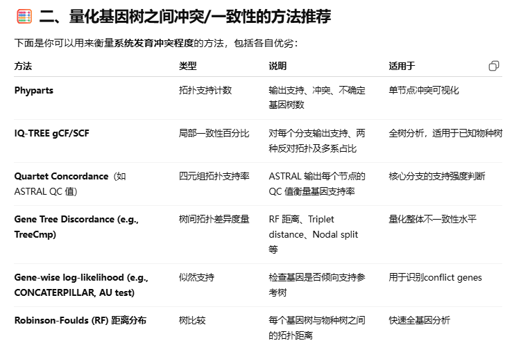
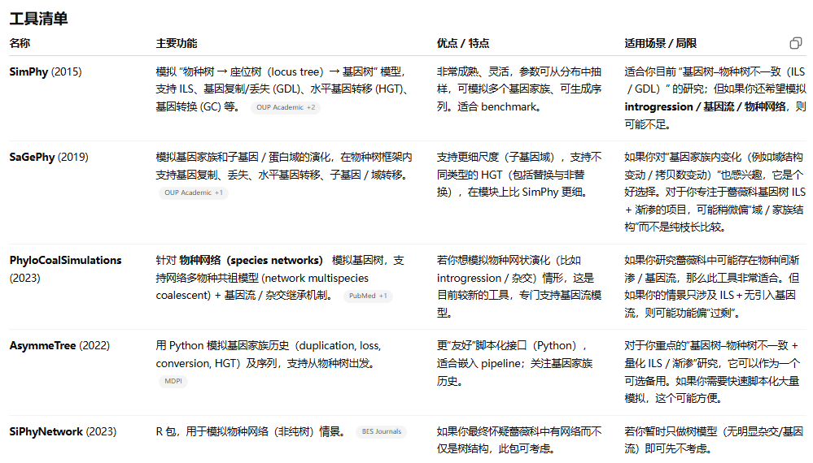

---
tags:
  - cytonuclear
---

# 1 
[[../../references/@Phylogenomic and macroevolutionary evidence for an explosive radiation of a plant genus in the miocene]]
- MDS衡量基因树与物种树之间到底有多么的不一致，是否可以借此找出哪些与物种进化方向截然不同的基因？
- 这种截然不同的基因与和物种树之间高度相似的基因到底有什么不同？
- 使用什么方法来定义截然不同？P value??

# 2
[@Concatenation fails to describe the anomalous radiation of giant cockroaches (Blattodea\_ Blaberidae) despite moderate to low discordance](../../references/@Concatenation%20fails%20to%20describe%20the%20anomalous%20radiation%20of%20giant%20cockroaches%20(Blattodea_%20Blaberidae)%20despite%20moderate%20to%20low%20discordance.md)
串联法将全部的基因串联起来形成一个整体建树，在一定程度上增大了信息含量，是否可以认为是全基因组直接建树的简化版本？
当然因为串联法默认所有基因基于同一个方向进化，可能会和实际的生物学过程冲突从而导致误差也是无可避免的。
那么在这里我们设想以下的处理逻辑是否可行：
1. 通过建立基因树检测出渐渗基因等不稳定份子
2. 剔除不稳定份子后使用串联建树，溯祖建树
3. 比较溯祖建树与串联建树结果
有没有可能这样处理后的结果，串联结果比溯祖更加可靠（因为信息含量更高，且不存在干扰基因）？

# 3
数据模拟工具清单

---

## 相关文献链接

- [[@Concatenation fails to describe the anomalous radiation of giant cockroaches (Blattodea_ Blaberidae) despite moderate to low discordance]]
- [[@Phylogenomic and macroevolutionary evidence for an explosive radiation of a plant genus in the miocene]]
