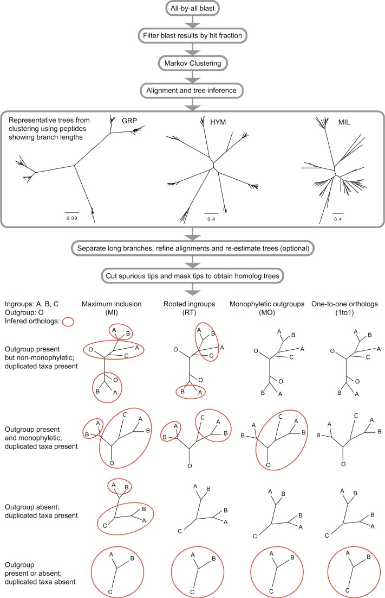
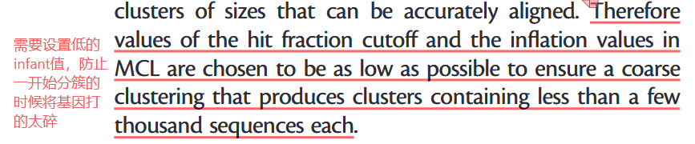
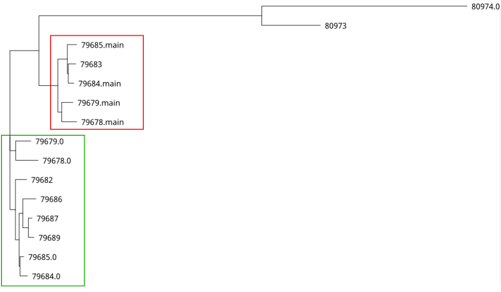
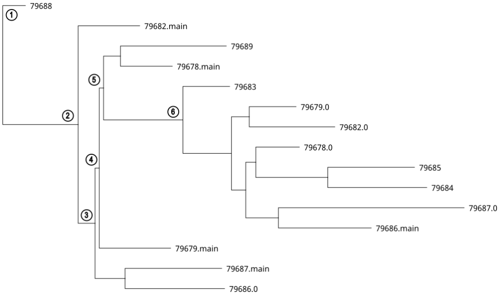
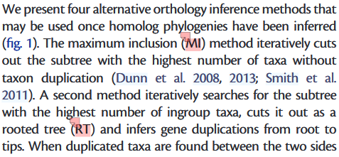
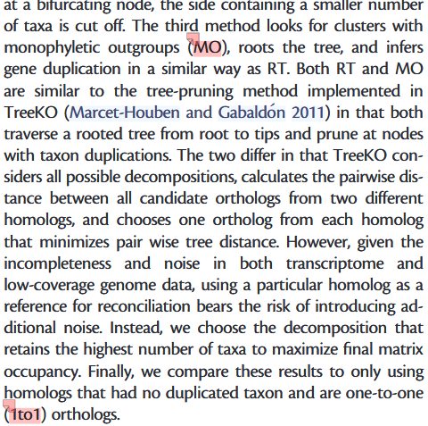
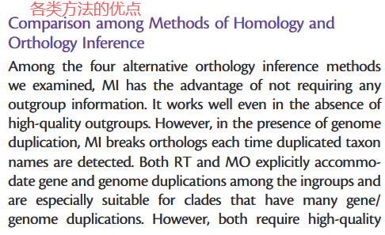
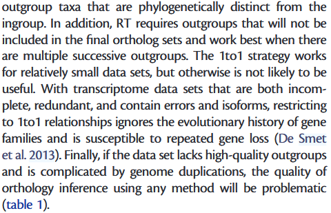

# 参考文献
[@Ya Yang, Stephen A. Smith\_2014](../../../../references/@Ya%20Yang,%20Stephen%20A.%20Smith_2014.md)
# Github
[Paragone_old_2015](https://bitbucket.org/yangya/phylogenomic_dataset_construction/src/master/)
[Paragone_new_2018](https://bitbucket.org/yanglab/phylogenomic_dataset_construction/src/master/)
[Paragone_GITHUB](https://github.com/chrisjackson-pellicle/ParaGone)
[Full_pipeline](https://github.com/chrisjackson-pellicle/ParaGone/wiki/Tutorial#step-3-tree-qc-and-sequence-extraction)
# 文献说明

## 1. 流程说明
下图为文献中提到的旁系同源去除方法流程图。

# **基于本人的理解，可以大致将其划分为以下几个关键的步骤：**
### 1）同源簇的初步构建
1. 对所有物种序列进行**All-by-all BLAST**，计算相似性分值
2. **过滤短序列**，基于比对长度占序列全长的比例（Hit fraction）过滤掉那些虽然相似但太短的碎片，防止这些碎片像“粘合剂”一样把不相关的基因家族拉进同一个簇。
3. Markov Clustering (MCL 聚类)： 利用过滤后的 BLAST 结果构图并聚类，生成初步的“同源基因簇（Homology Clusters）”。这些簇里通常包含基因家族的所有成员（包括所有拷贝和异构体）。
==**在这一步骤里需要额外注意的是，进行分簇时尽量进行粗分簇，过于严苛可能会导致基因的同源性出现问题**==
一般来讲并不会执行这一步，这一步是针对全流程而言，即不适用hybpiper等工具，而是直接从原始序列开始使用paragone的话才会使用到这一步骤，因此对于我们的研究，其不是打碎基因的元凶，目前看来基因碎成小块更有可能是Cutting deep paralogs步骤时，将允许的内部枝长设置的过于严苛，导致很容易断开成两半。

## 2）序列清理和同源树构建
1. Alignment and tree inference (比对与建树)：
   - 对每个簇进行多序列比对（MAFFT）。
   - 构建初步的系统发育树（FastTree 或 RAxML）。
2. Separate long branches (切割长枝 - 可选)：
   - 如果在树上发现极长的分支（通常由误组装或严重突变引起），将其切断。==这一步可能导致基因被切成不同的子基因==
   - Refine alignments (精细比对)： 切断长枝后，重新对子簇进行比对并重新建树，以提高准确性。
3. Cut spurious tips and mask tips (清理梢端)：
   - 剪除伪分支： 删掉那些异常长的终端分支（Spurious tips）。
   - Masking (掩盖异构体)： 针对同一个物种在树上形成的单系或并系小簇（剪接变体），只保留一个质量最好的序列，删掉其他。
   - 最终产出： 得到清理干净的 “同源基因树” (Homolog Trees)。

## 3）直系同源提取 (Orthology Inference)
**此步骤为流程的核心步骤，其本质即==使用不同的方法去除每一个基因中的重复物种序列==**
其中一共包含了MI,MO,RT,1to1四种不同的策略，但是他们都是执行同一任务，即去除重复的物种序列。下面将展开描述，各个方法的基本逻辑及其优劣。

### MI (maximum inclusion)
**基本原理**：最大包容的算法，即不关心演化过程，只关注最终结果。从最终的树中切出一个包含有尽可能多的，且没有重复物种的子树
**优点**：最大化利用数据矩阵，不需要外类群。适合那些外群物种不明确或难以获取的非模式生物研究
**缺点**：当存在基因组复制时，MI会在每次检测到重复分类单元名称时断开正交关系，且不尊重生物学事实
**具体操作**：如下图所示，MI会将红色框和绿色框分开，因为这两个框中存在重复的物种，分开的两个子树都会保留。同时外类群会和绿框聚到一起，因为绿框中的物种数量更多。

### RT(rooted tree)
**基本原理**：从根部出发往tips端走。只要看到一个节点左右两边出现了相同物种，就在这里切一刀，去除物种数量少的一枝
**优点**：符合生物学事实，按照基因重复时间挑选分支。适用于存在大量基因/基因组复制的分类群
**缺点**：需高质量且与内群系统发育上截然不同的外群分类单元
**具体操作**：如下图所示，RT会在内类群的每一个节点进行判断，如节点一的“79688”会被保留，且不会在1号几点切开，因为“79688”仅有一份。而在2号和3号节点，数量少的分支会被直接舍弃，因为其存在重复且分支包含的物种数量过少，不足默认的阈值4个taxon。如果分支存在重复且较少的分支中的tips数量大于4，则会被切开并保留为两棵树。

**与MO的区别在于：** RT要求外群不可纳入最终正交基因集，且在存在多个连续外群时效果最佳
### MO (monophyletic outgroups)
**基本原理**：同RT，但是要求外类群必须全部为单系
**优点**：符合生物学事实，按照基因重复时间挑选分支。适用于存在大量基因/基因组复制的分类群
**缺点**：需高质量且与内群系统发育上截然不同的外群分类单元
**具体操作**：类似MI，但是不会同时保留红框和绿框的分支，只会保留物种数量更多的一个分支。某种程度上，MO可以算作MI的子集。
### 1to1(one-to-one)
**基本原理**：只要存在一个重复的物种，直接舍弃掉整个基因
**优点**：绝对的纯净
**缺点**：数据利用效率低

原文描述如下：
**原理描述：**

**优缺点描述**

## 讨论
针对paragone的基本属性和原理，我们可以得出以下结论：

- 为什么使用单拷贝的353或者orthofinder的单拷贝作为参考基因，使用hybpiper提取后还需要去旁系。因为hybpiper会从重测序或转录组数据中抽取到和单拷贝基因最为相似的多个基因，会被依次标注为 `*.main`,  `*.0`,`*.1`等，其中`.main`是hybpiper认为的最优序列。

- paragone的流程除了去除旁系同源外，还能够去除长枝和异质性较强的序列，也能在一定程度上提高序列的品质。

- 当然对于353这类本身基因数量就不多的参考集，再使用paragone的算法去旁系可能会导致基因数量锐减，从而丧失掉部分信息。所以个人感觉上可以酌情使用，如果不去旁系和去除旁系最终得到的物种树相差无几，表明旁系同源对系统发育推断的干扰作用几乎没有，此时可以考虑直接使用hybpiper提供的全集，毕竟.main基因也是推断出的最优基因，具有一定的可靠性。

**什么时候应该用paragone**
- OrthoFinder 的单拷贝基因中只给了很少的OG，导致建树信号不足。而数据中有上万个基因，其中大部分被鉴定为多拷贝基因时。此时，可以运行 Paragone 从多拷贝基因中再“切”出 若干个能用的直系同源基因。

---

## 相关文献链接

- [[../../../../references/@Ya Yang, Stephen A. Smith_2014]]
