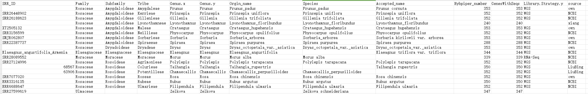
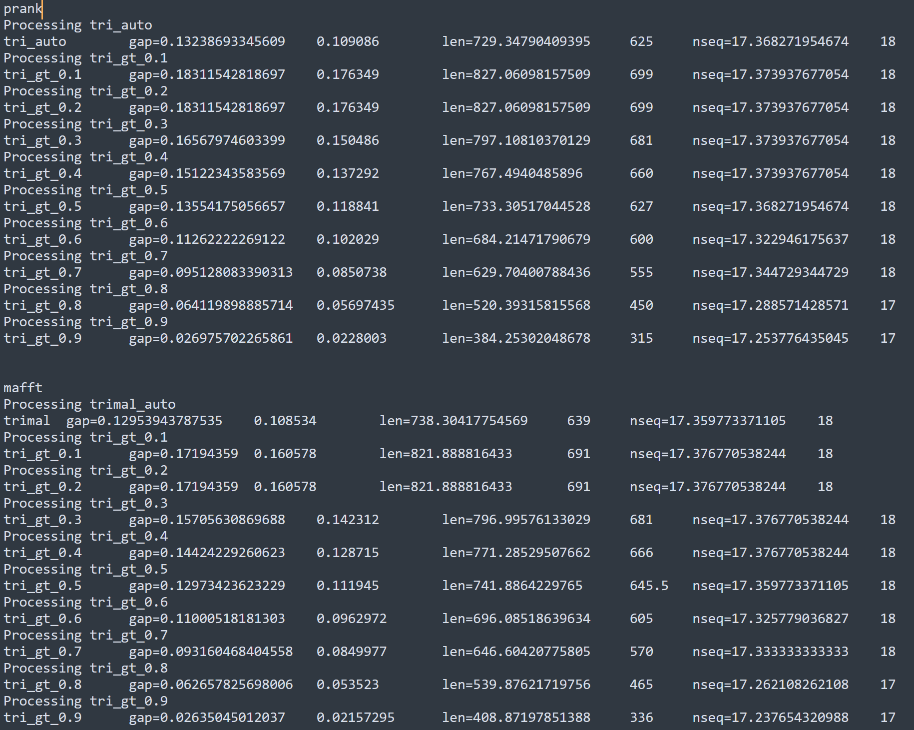
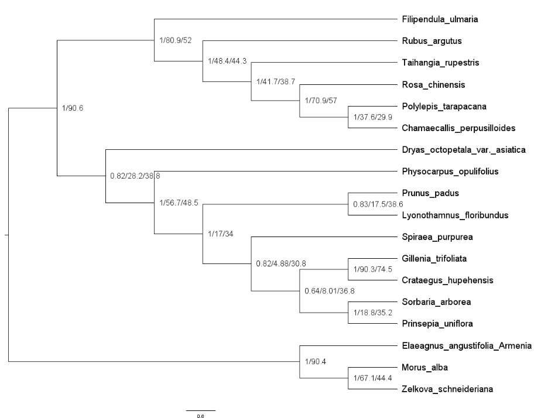
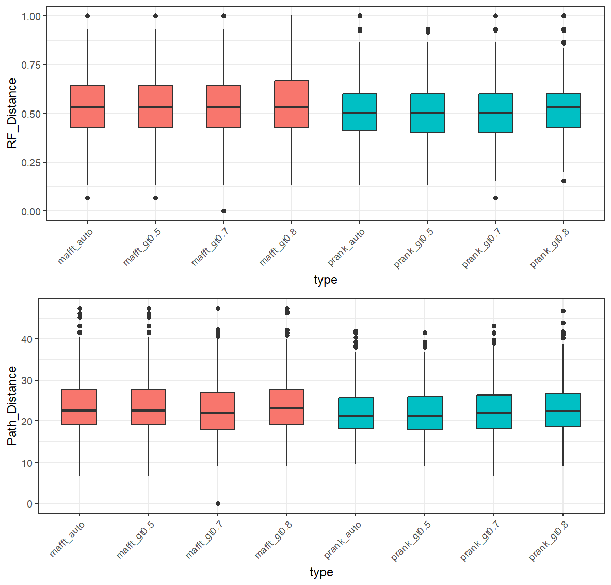
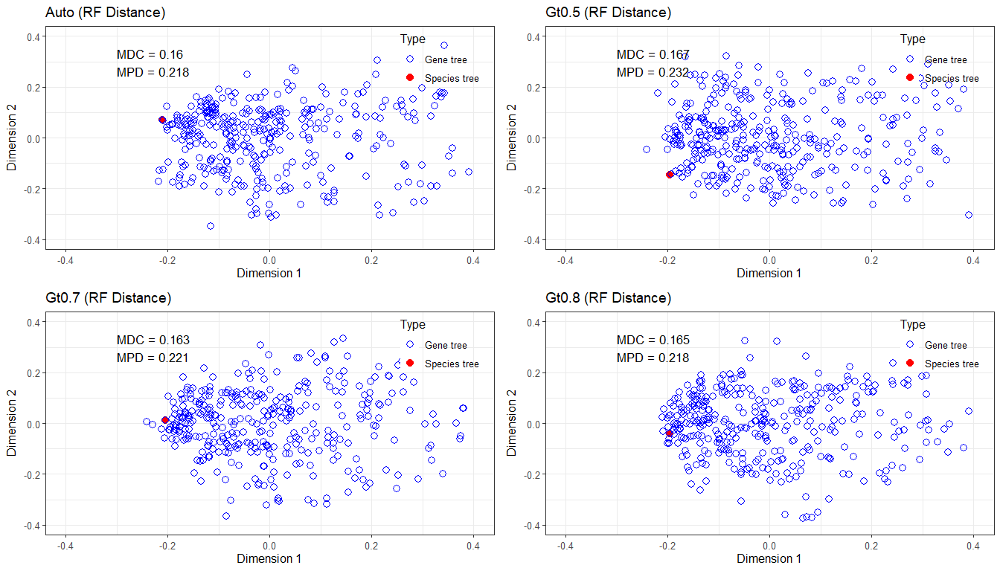
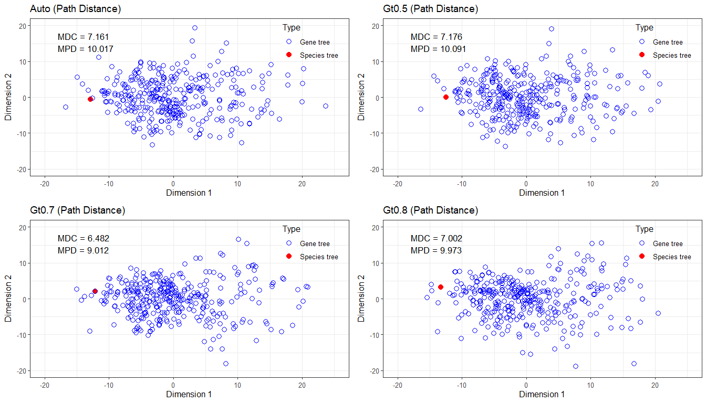
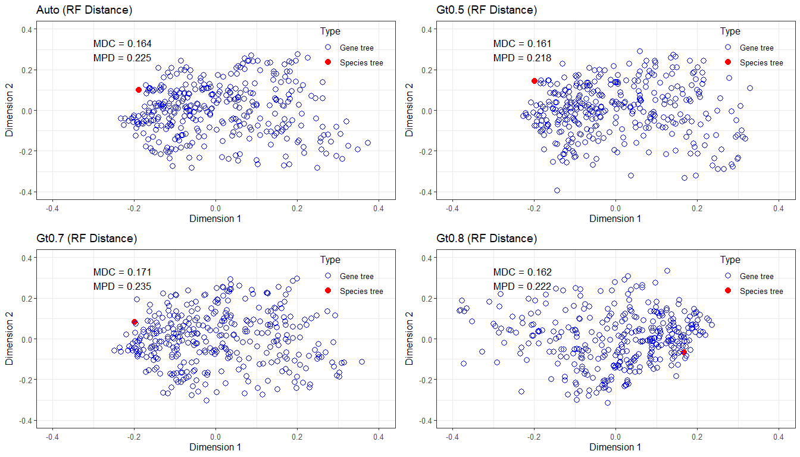
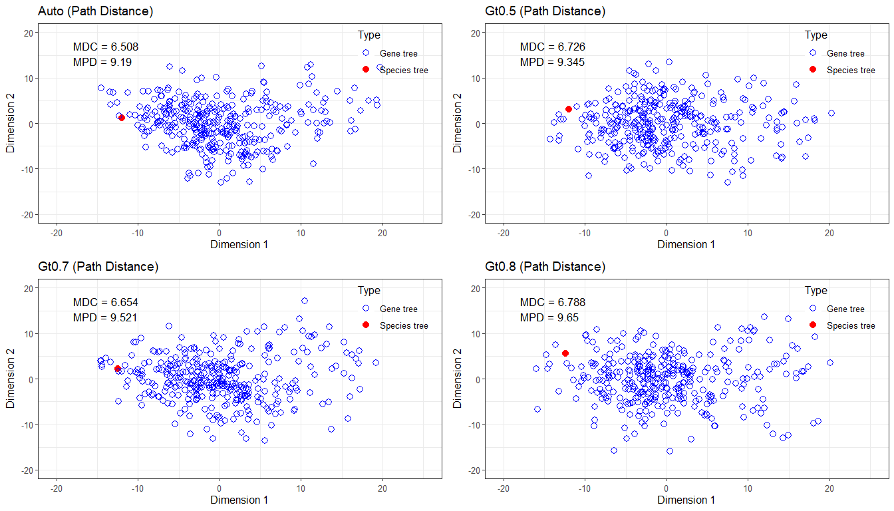
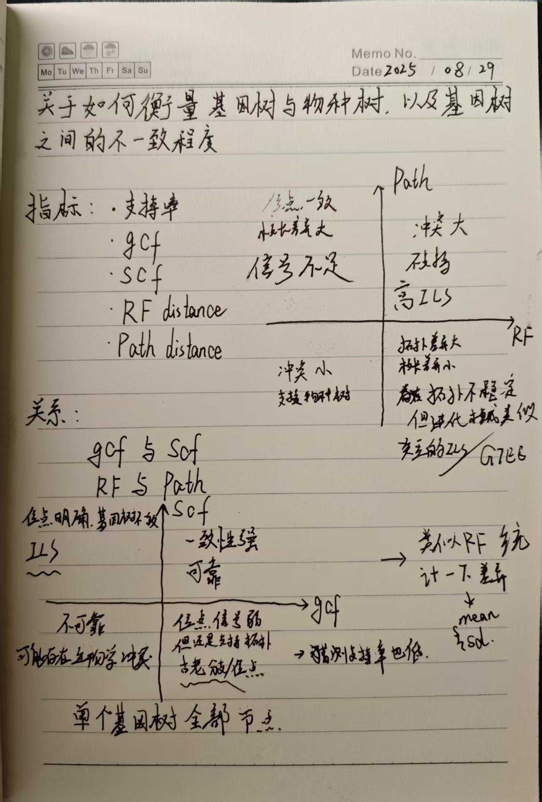

### 说明
本流程主要用于记录在进行tribe_final数据集分析时的部分步骤，并非完整流程。

### 处理位置
服务器一：
```
/home/xiongtao/data/project/Rosaceae/ILS/tribe_final
```

### 数据集合
蔷薇科15族中，每族取一属为代表进行研究。
具体信息见表格，位置在本地电脑：
```
E:\Project\Rosacea\Rosaceae_fruit_type\seq_data\Final_select_by_R_NCBI_seq_data5.xlsx
```



# 1. 数据初步过滤
拟进行数据的初步过滤，主要目的有以下几点：
- 使用prank对数据进行初步过滤，保证序列数据的同源性可靠
- 使用spruceup来去除数据的异质性，不过可以在mafft比对后直接检查是否不同的物种序列之间存在较强的异质性，如果没有则无需进行此步骤
- 使用trimal/phyx进行数据过滤，提高序列数据的信息含量，去除gap
- 使用treeshrink进行基因树的长枝去除，避免长枝干扰最终结果

## prank

```
python /data/xiongtao/project/Rosaceae/tree/hybpiper_orgin/prank_wrapper.py ./mafft ./prank mafft dna
```

```
for name in prank/*.aln; do
    tt=$(basename "$name" .mafft)

    # 遍历一系列gap threshold值
    for gt in 0.1 0.2 0.3 0.4 0.5 0.6 0.7 0.8 0.9; do
        trimal -in "$name" \
               -out "trimal_prank/${tt}.gt${gt}.tri.fasta" \
               -gt $gt -st 0.001
    done
done
```

prank之后需要对序列标题行进行处理，只保留物种名.

```
# 对序列修改
for dir in */; do
  cd "$dir" || exit
  for seq in ./*.fasta; do
    sed -i -E '/^>/ s/_multi[^ ]*//g; /^>/ s/_single[^ ]*//g' "$seq"
  done
  cd ..
done


# 对系统发育树修改
for name in gt0.8_root/*.tre;do
  pxrlt -t $name -c old_name.txt -n new_name.txt>gt0.8_new/$(basename $name)
done
```
## trimal
#### Auto
```
for name in ls mafft/*.mafft; do     
  tt=$(basename $name .mafft);     
  trimal -in $name -out trimal/${tt}.tri.fasta -automated1; 
done
```
#### -gt  -st

-gt意识是列里非gap比例大于0.8才予以保留，**数值越大，筛选条件越严格**。-st则是指的相似度要求需大于所设定的值，一般范围为0.001-0.01，过大的话会去除掉系统发育中的变异位点导致系统关系难以区分。
```
for name in mafft/*.mafft; do
    tt=$(basename "$name" .mafft)

    # 遍历一系列gap threshold值
    for gt in 0.1 0.2 0.3 0.4 0.5 0.6 0.7 0.8 0.9; do
        trimal -in "$name" \
               -out "trimal_tests/${tt}.gt${gt}.tri.fasta" \
               -gt $gt -st 0.001
    done
done
```

## 统计gap占比，序列长度，物种丰富度
```
for dir in `ls -d */`; do
  echo "Processing $dir"

  # gap占比
  gap=$(for f in $dir/*.fasta; do
    pxlssq -s $f -m
  done | datamash mean 1 median 1)

  # 序列长度
  len=$(for f in $dir/*.fasta; do
    seqkit fx2tab -l -n $f
  done | datamash mean 2 median 2)

  # 序列条数
  nseq=$(for f in $dir/*.fasta; do
    grep -c ">" $f
  done | datamash mean 1 median 1)

  # 输出一行
  echo -e "$dir\tgap=$gap\tlen=$len\tnseq=$nseq"
done

```
#### 对mafft与prank统计结果：


根据结果，选择auto,0.5,0.7,0.8建树做进一步的检测
```
for name in ../trimal_prank/tri_gt_0.5/*.fasta; do
  base=$(basename "$name" .fasta)
  echo "Running $base ..."
  echo $base
  iqtree -s "$name" -m MFP -B 1000 --bnni -T 10 --prefix ./gt0.5/${base}
done
```

基因树重置根
```
for tree in ../gt0.8/*.treefile; do
    nn=$(nw_labels -I $tree|grep -c -E "Elaeagnus_angustifolia_Armenia|SRR28089552|SRR27599619")
    if [[ $nn -gt 0 ]]; then
        tt=$(nw_labels -I $tree|grep -E "Elaeagnus_angustifolia_Armenia|SRR28089552|SRR27599619"|paste -sd,)
        mm=$(basename $tree .treefile)
        pxrr -t $tree -g $tt >${mm}.rt.tre
    else
        Rscript /home/xiongtao/data/scripts/mad_reroot.R $tree
    fi
done
```

ASTRAL建立物种树
```
cat ../gt0.8_new/*.tre>rosa_sp_genes.tre

#Astral建立物种树
java -jar /home/xiongtao/data/software/ASTRAL-master/Astral/astral.5.7.8.jar -i rosa_sp_genes.tre -o rosa_Astral_species.tre

#重置根
pxrr -t rosa_Astral_species.tre -g Elaeagnus_angustifolia_Armenia,SRR28089552,SRR27599619 > rosa_Astral_species_rt.tre
#合并超级矩阵
pxcat -s ../../trimal_prank/tri_gt_0.8/*.fasta -p rosa_sp_partition.txt -o rosa_sp_supermatrix.fasta
```
## 系统发育树检测
根据如下几点进行检测评估：
- bootstrap即支持率的大小
- likelihood值的大小
- 基因树与物种树的差异， 通过RF距离 path距离 gcf scf值的大小来判断，通过MDS方法来可视化
### Support / gcf / scf

利用iqtree计算support / gcf / scf
```
iqtree -t rosa_Astral_species_rt.tre -s rosa_sp_supermatrix.fasta --gcf rosa_sp_genes.tre --scf 1000

#单独储存
mkdir supp_gcf_scf
cd supp_gcf_scf
mv ../rosa_Astral_species_rt.tre.*  ./

```

从计算的结果中提取出support / gcf / scf。结果储存在`rosa_Astral_species.tre.cf.stat`文件中，或者直接从树文件中提取。
```
Rscript ~/data/scripts/Get_support_value.R rosa_Astral_species_rt.tre.cf.tree
```

### RF / Path distance
计算RF / Path distance，同时进行数据分析，目的如下：
- 量化物种树与基因树之间的差异，计算均值与标准差来衡量
- 量化全部基因树及物种树之间的差异，通过MDS运算降维并可视化，计算点到质心平均距离（mean distance to centroid）和平均两两距离（mean pairwise distance）来量化
```
Rscript ~/data/scripts/MDS.R rosa_Astral_species_rt.tre rosa_sp_genes.tre
```

## 结果解读
使用MAFFT比对，gt0.5参数设置的物种树如下：


物种树与基因树的差异展示如下:


MDS结果展示如下：
maft



prank



根据以上结论，我们可以发现，prank整体是要由于mafft比对的结果，只是并不显著。然后考虑到后续进行旁系同源筛选的时候，paragone内嵌的比对程序为mafft，所以最终决定还是使用mafft的gt0.5为最终的数据集。
> 如果特别想要使用prank，那么后续可以使用PhyloPyPruner来进行旁系同源基因的筛选工作

此外，对于上述结果，有几点可以讨论：

1） scf，scf值的运算是根据**序列位点**来判断**物种树的各个节点**得到了多少的支持。相较于MSC，QuBIL等从拓扑出发进行ILS推导的方法，有一定的不同之处。后期是否可以单独以scf值，或者说从序列出发，进行三联体，四联体的分析，然后推导出ILS

2）MDS，从MDS的点图中，可以再深入探讨以下几点：
- 物种树与基因树集团的距离是否可以衡量，例如物种树到基因树集团中心点的距离，物种树与基因树之间的两两距离，来衡量物种树与基因树集团的差异。
- 基因树集团是否可以再次分类，类似PCA分成几个不同的聚类。然后，聚类的数量，是否反映了什么问题，例如来自于同一个物种的渐渗基因会聚类到一起。
>渐渗基因和物种原来的基因有什么本质区别吗

3） gcf与scf，RF distance与Path distance之间的关系，划分成四个象限后，是否可以根据不同基因树，不同节点在象限中的位置来判断它们是否可能是ILS，IH的结果。


## 旁系同源基因的筛选

利用hybsuite筛选旁系同源基因并建树
```
hybsuite full_pipeline \

-input_list ./namelist_tribe.txt \

-eas_dir ./hybpiper_hybsuite \

-output_dir ./HybSuite_out_tribe \

-t Reference_353.fasta \

-OI 1234567b \

-min_sample_coverage 0.1 \

-min_locus_coverage 0.1 \

-min_length 200 \

-skip_stage 01 \

-nt 12 \

-process 5
```
