### 定义
**泛基因组**即某一物种**全部基因组的总称**

### 详细
泛基因组中的core基因和variable基因，其中
- core基因一般与基础的生命功能相关联，偏保守
- variable基因一般与一些特异功能和抗性相关，偏激进  
此外variable基因又可以继续划分为以下几类：
1. soft-core genes 
2. shell genes
3. cloud genes
>所以目前有关泛基因组的研究与作物育种有关的多。
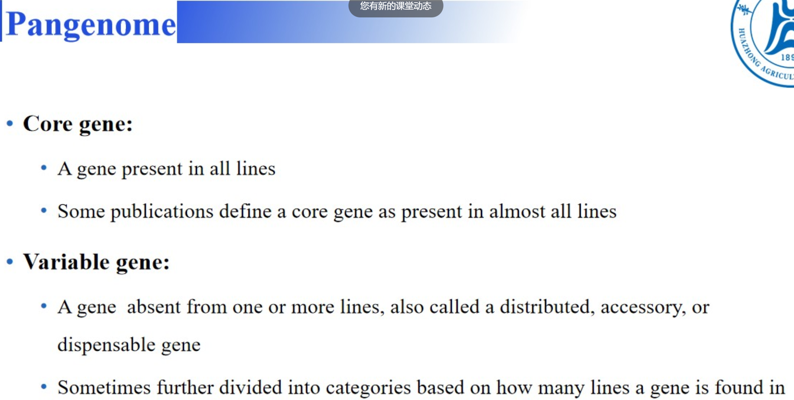
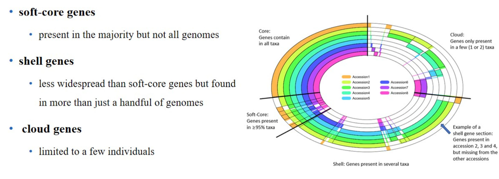

同时还有一种称呼为**super pangenome ** ，一般指囊括了野生种，甚至属水平的泛基因组。
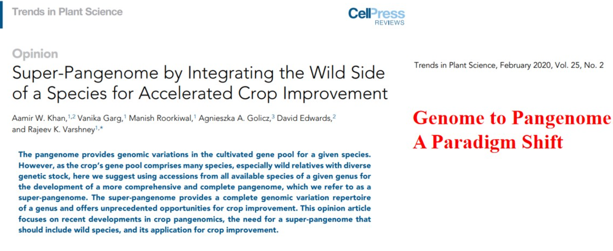

结构变异：
分为以下5大类
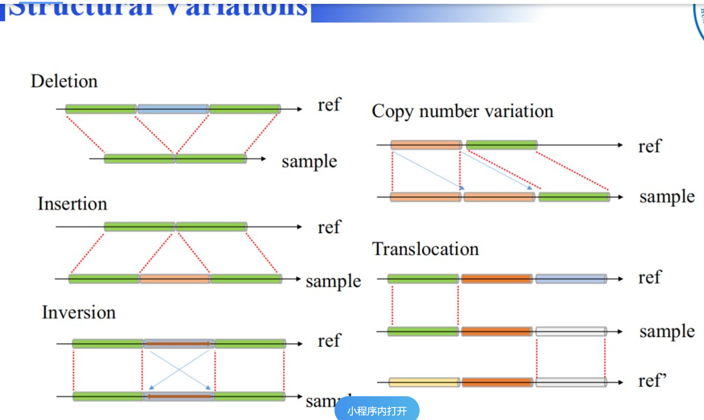

结构变异发生的原因一般也分为4大类：

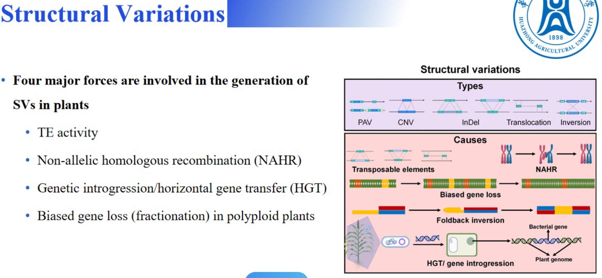

### 泛基因组的优势
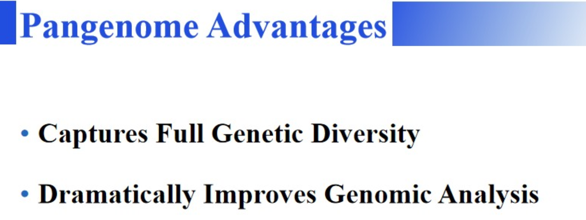

# 如何组装泛基因组
其中主要是变异位点的展现方式，相较于SNP的VCF文件要更加立体全面
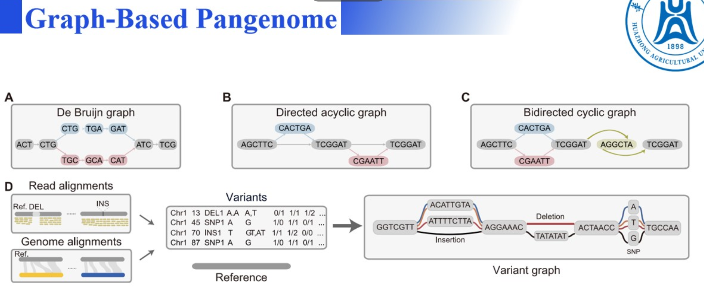

泛基因组的结构，
主要区分共有区域（nodes）和变异区域（Bubble）
其中path是指不同的物种的路线，例如紫色的就是指AT>G>TCCATCAC这样的一个路径
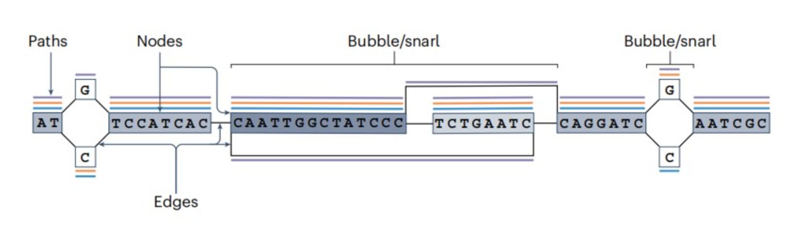

### 采样策略：
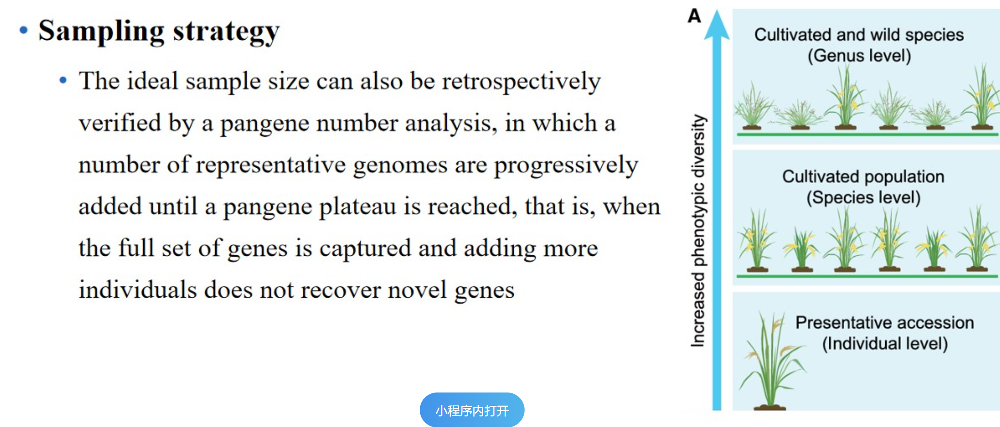

### 测序策略：
可以尝试不用测HI-c,而扩大取样多测几个样本的HI-F数据。
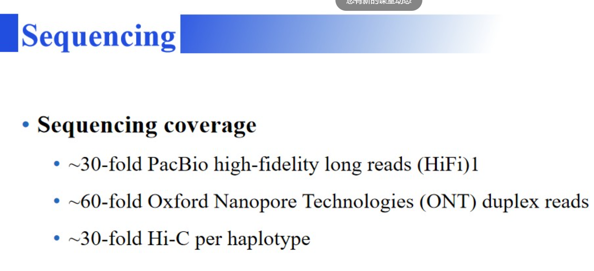

### 高质量的泛基因组
前提是至少需要一个完整的，高质量的基因组，能够为整个泛基因组提供一个完整的参考坐标。避免在后续分析中，将未能测序到的位置鉴定为变异信息。
其次，若条件允许，可以所有的基因组都使用从头组装，提供完整的信息
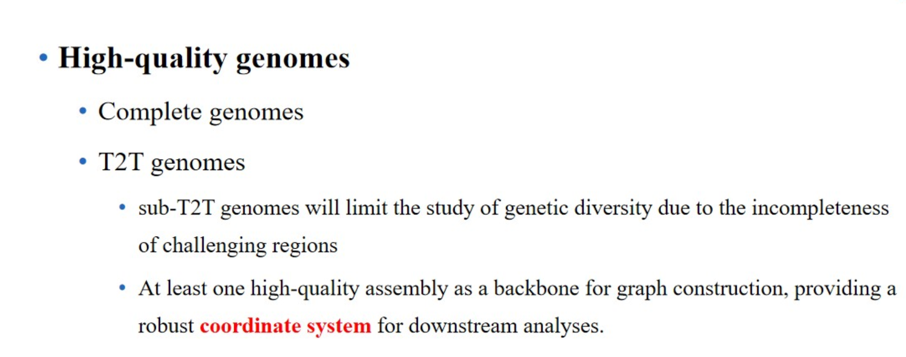

### 各种工具介绍
其中Minigraph使用较为主流，优点是对算力要求相对较弱
而PGGB相对来说能够组装出更多的内容，但是对算力要求更大。
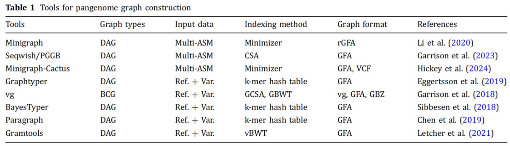

### 泛基因组文件格式
GCA文件格式
其中L代表link，即overlap区域，其中+表示正链，-表示负链。后面的4M表示有4个碱基重叠了。
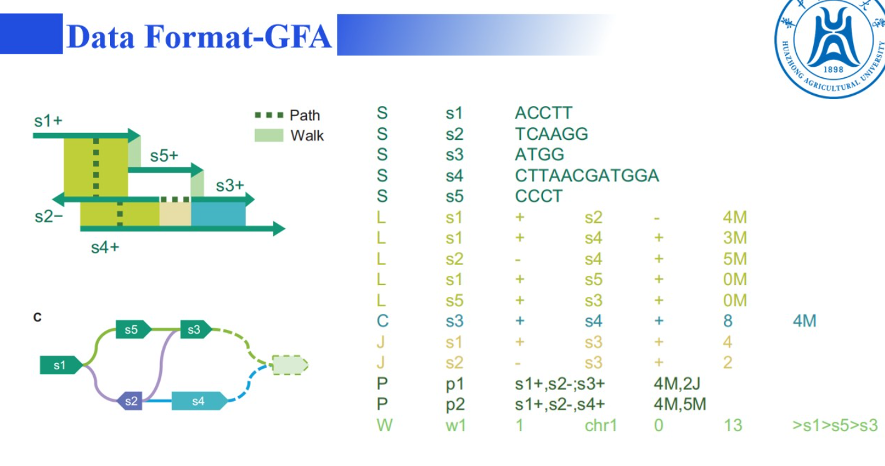

### 如何将GCA文件可视化后续分析
