主要工作在于确定基因的**位置**与**功能**。即结构注释与功能注释

主要分为以下三个步骤：
1. 重复序列屏蔽，同时还可以屏蔽一些低复杂性的基因（low-compliexity DNA）
> 低复杂度的DNA即ATCG碱基的出现不在展现随机性，而展现出某种偏好性和规律性
2. 结构注释
3. 功能注释

1.重复序列，
分为串联重复和散在重复，中间的间隔可能为转座子
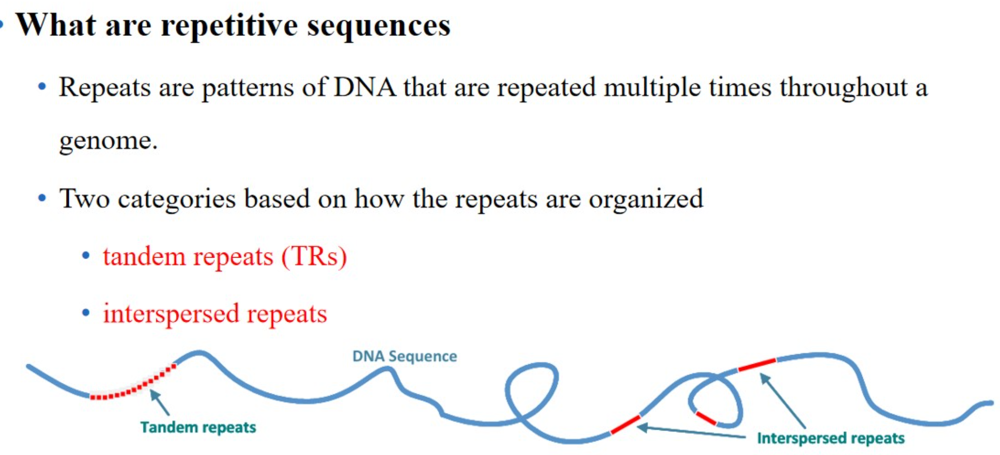

转座子主要分为两类
- 反转录转座子，classⅠ，先复制再移动，会增加拷贝数
- DNA转座子，classⅡ，直接cut然后移动，不会增加拷贝数
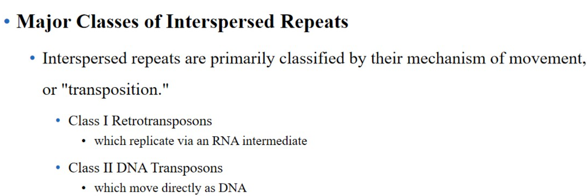
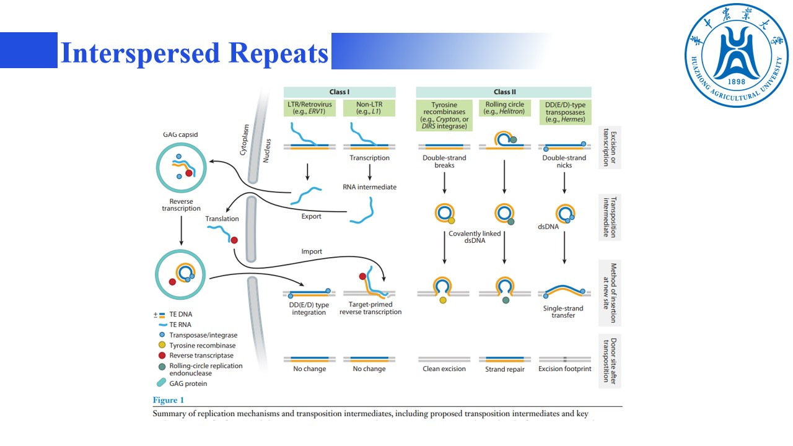

一些转座子类型的显著特征，classⅠ
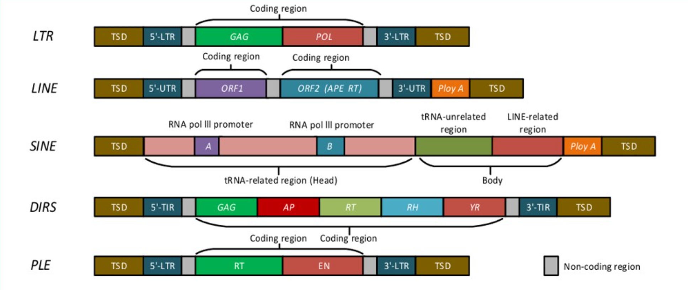

### 重复序列情况汇总：
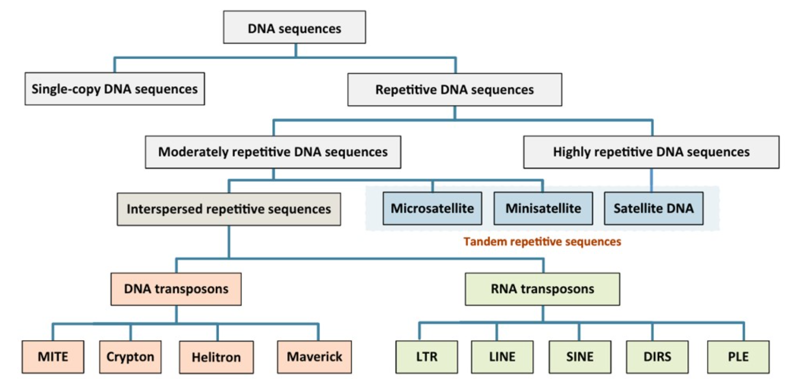

转座子的影响：
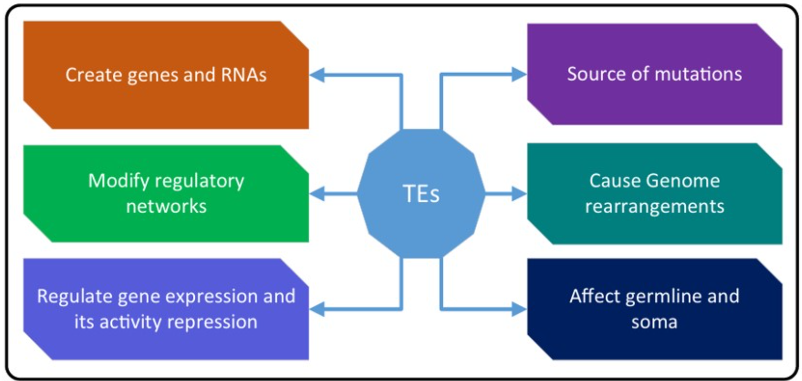

### 重复屏蔽策略
- soft masking 将原本序列变化为小写字母，目前更为常用，因为可以保留信息
- hard masking 直接转换为N
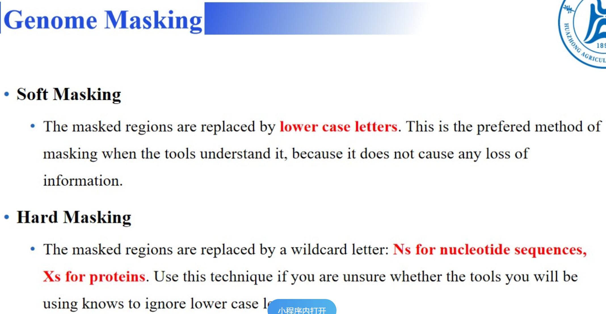

### 结构注释
除开传统工具外，现在有基于**DEEP Learnning**的工具，优点是集成，更加省时，不用频繁调参。
缺点是目前似乎最终鉴定的基因数量相对偏少
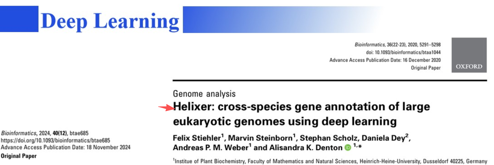

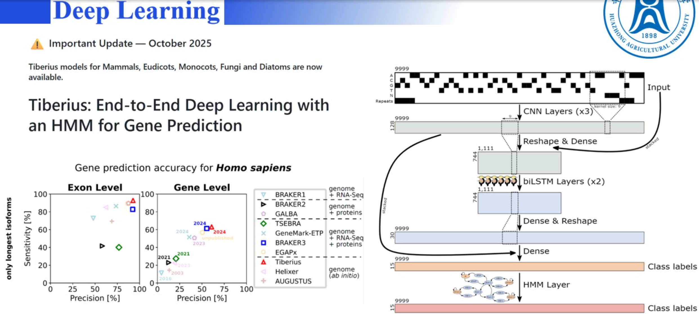

#### 在使用他人基因组分析寻找基因时，建议测一组转录组数据进行检验。

#### 基因功能注释高质量数据库
注意不同数据库中的ID是不同的，我们需要先将数据库的ID统一，建议将uniprot的ID转化为NCBI的refseq的ID，然后取并集。
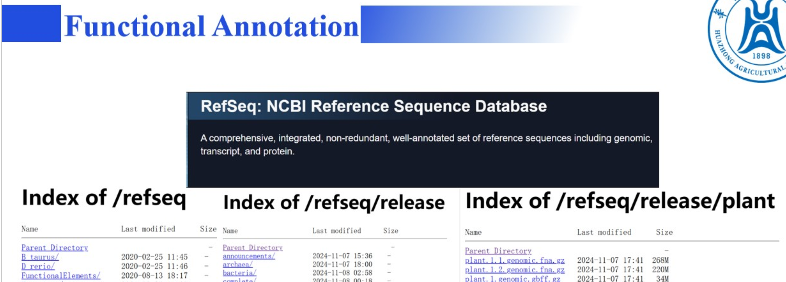
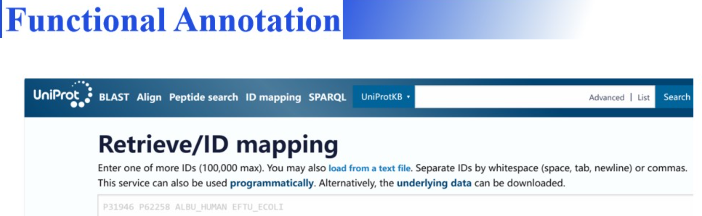
同时若只想想要简易的进行功能注释，也可以尝试以下工具：
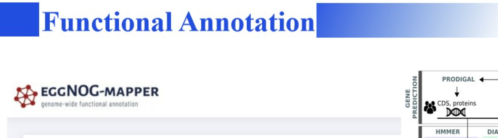

同时基因组注释完成后，还需要进行完整性检验，一般使用BUSCO,但是现在主流也在使用**OMArk**
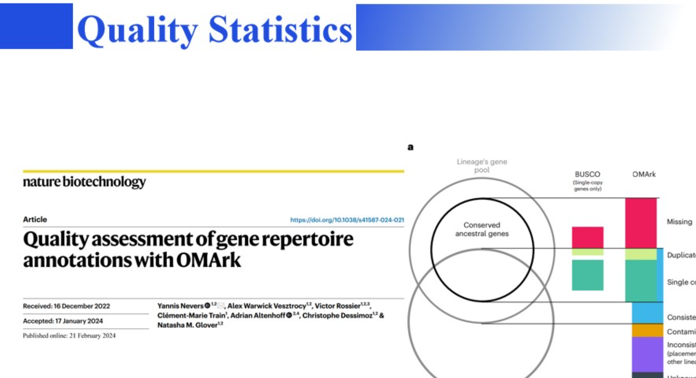