### 说明

二代测序流程
- 速度快，价格便宜
- 测序长度较短，**无法用于基因组组装**

三代长读长测序
HiFi
- 测序长度较长
- 测序错误率较二代要高

ONT
- 超长测序
- 从头组装一般使用HIFI+ONT
- 测序质量相对低

不同测序平台相关信息
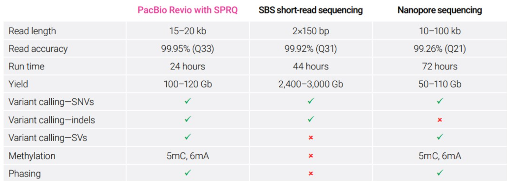

### Why sequence genome
基因组技术总结
- 从一代测序到三代测序
- 从单个基因组到泛基因组
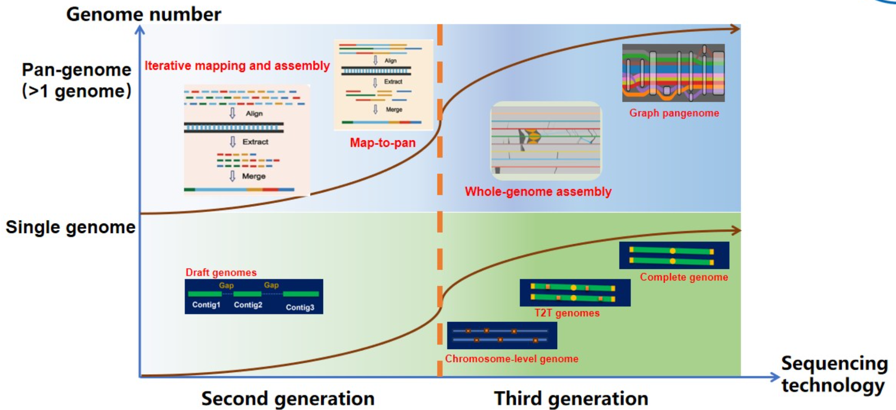

**测序长度**，进制就是10进制，即1kb为1000个碱基。
碱基数量的kb是**kilobase**
计算机储存的字节kb是**kilobyte**

## kmer
通过kmer来估算基因组的大小

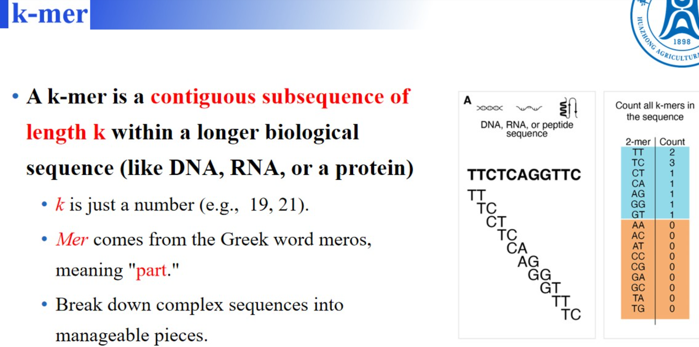

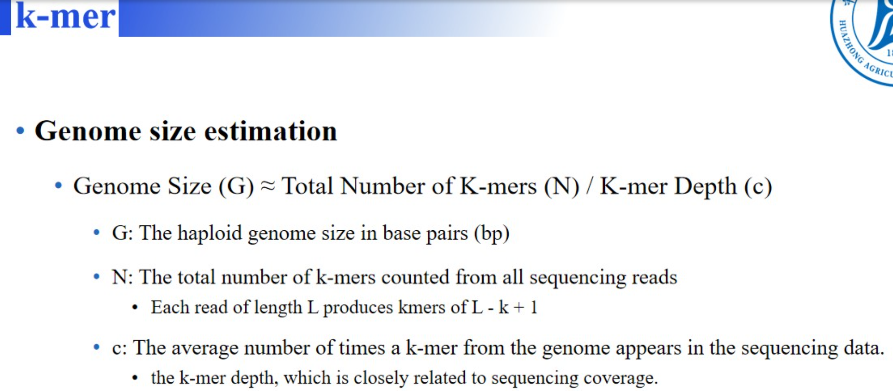

### K-mer长度的选择
过长过短都会影响最终计算的基因组的大小
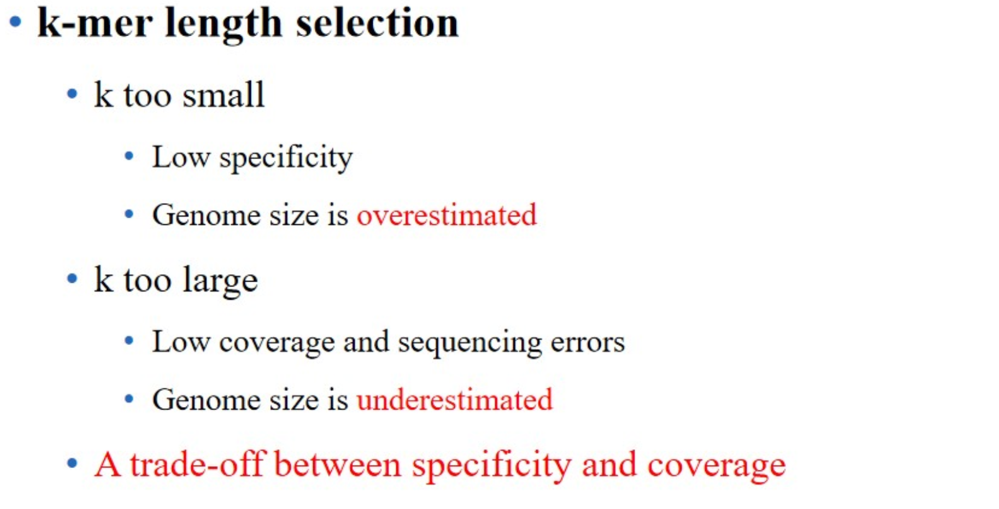

一般来讲，k-mer选择为17，19，21bp的长度即可，一般选择**奇数长度**。
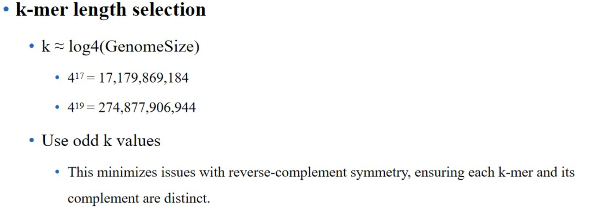

### Genome survey工具
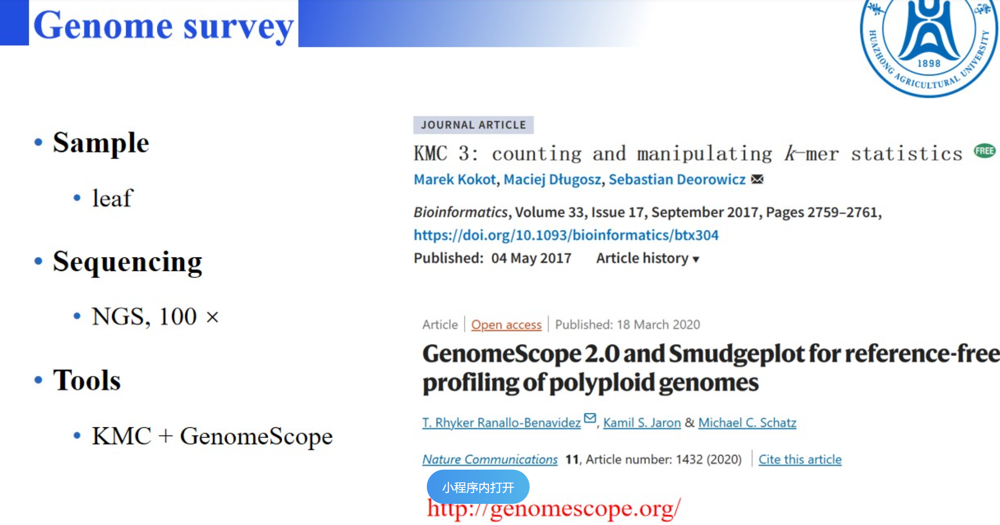

**倍性评估工具**
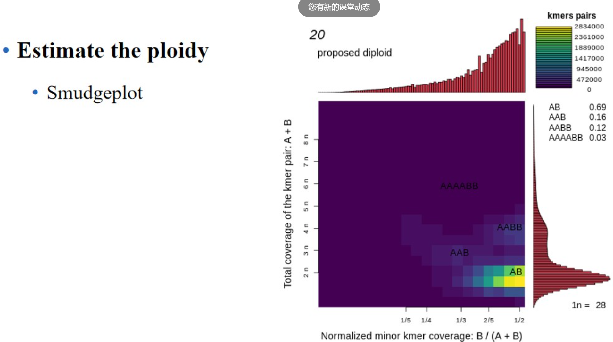

### 测序数据质量控制

### 二代测序
主要使用**fastQC**进行质量检测，主要查看Per base sequence quality
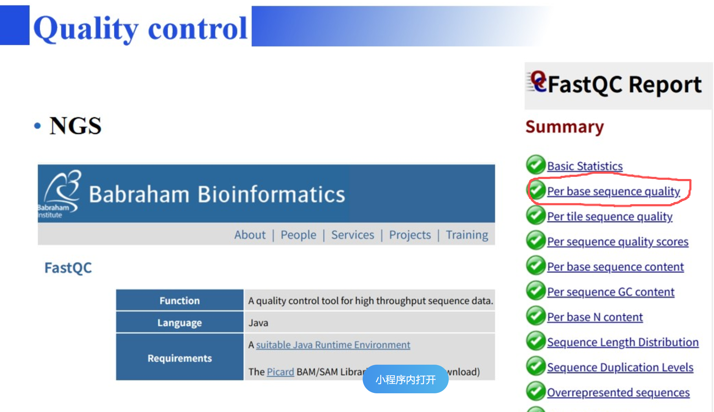
### fastp工具进行质量控制
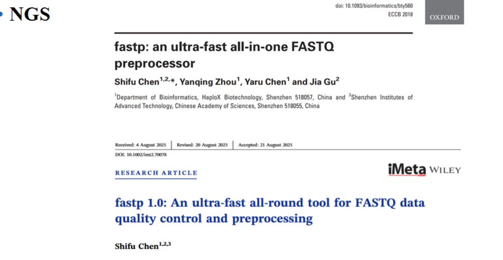

**multiQC**进行质量控制数据整合
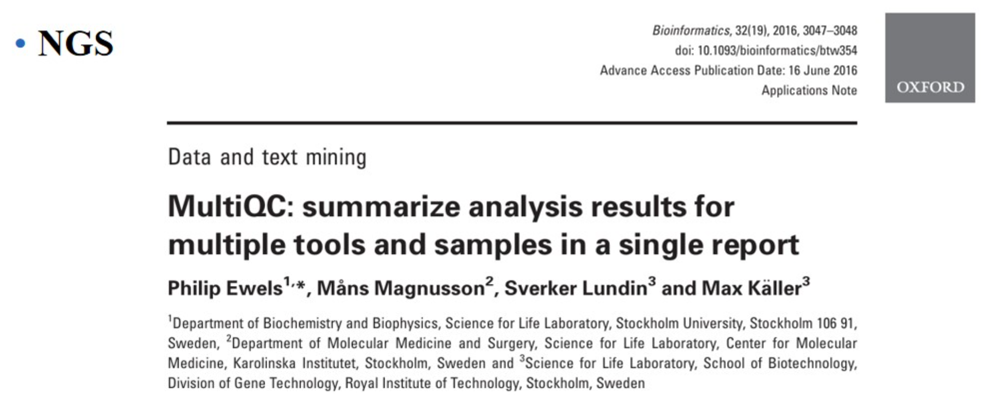

### 三代测序
**NanoPack2**统计汇总三代测序数据质量
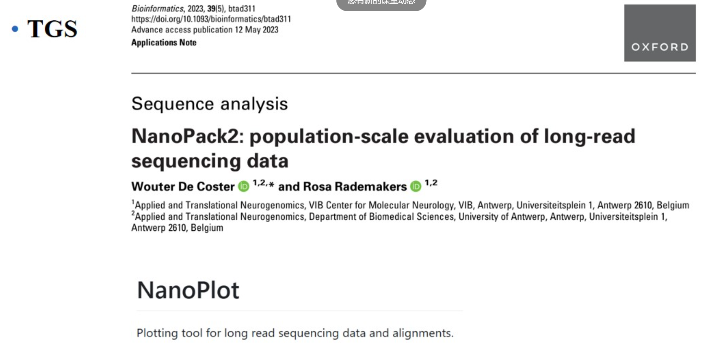

**fastplong**
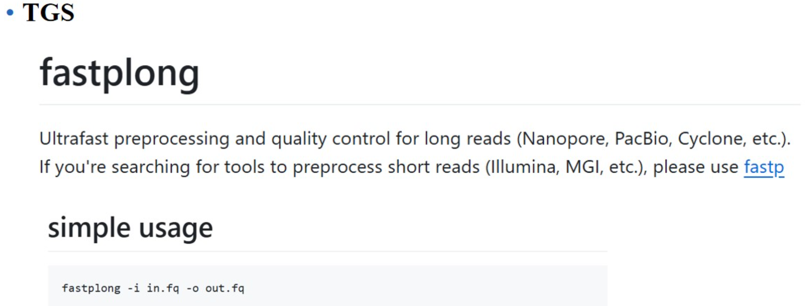

**Seqkit2**进行序列操作
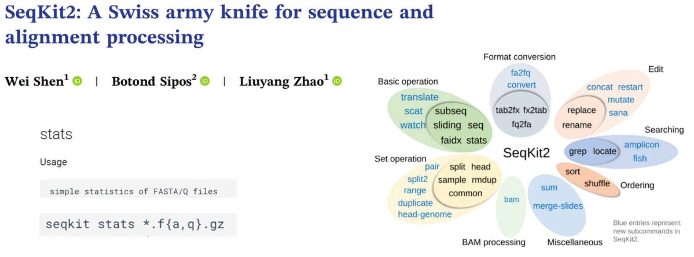

### 基因组组装，先组装质体基因组，然后提取这部分序列后再组装核基因组

### 基因组组装的策略
- liheng 基于overlap来进行contig的组装
- 基于k-mer来进行的contig组装

## 染色体的命名
首次命名需要按照染色体的大小顺序来依次命名
如果该物种已经发表过染色体，则需要按照已发表的染色体名称来命名

### 组装质量检测
连续性：主流还是通过N50值来检测

完整性：
对于重复序列，通过LAI程序来检测。
同时还可以通过k-mer来比较，如果出现了组装的基因组有对应的k-mer而原始的reads里没有，则要考虑可能是组装错误导致的。
反之，则可能是组装不完全或者组装的质体基因组导致的

正确性
reads都为纯和碱基，组装的为不同碱基，说明是组装错误或者HIF HIC错误，也可能是校准错误。
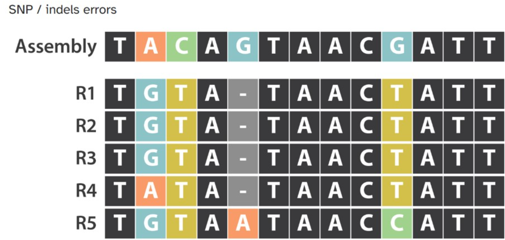

在使用共线性分析的时候，与他人已经组装过的基因组进行比较，发现最终共线性没有呈现一条对角线而是存在重叠的区域。那么可以认为自己组装的过程中存在重复区域或者插入的错误
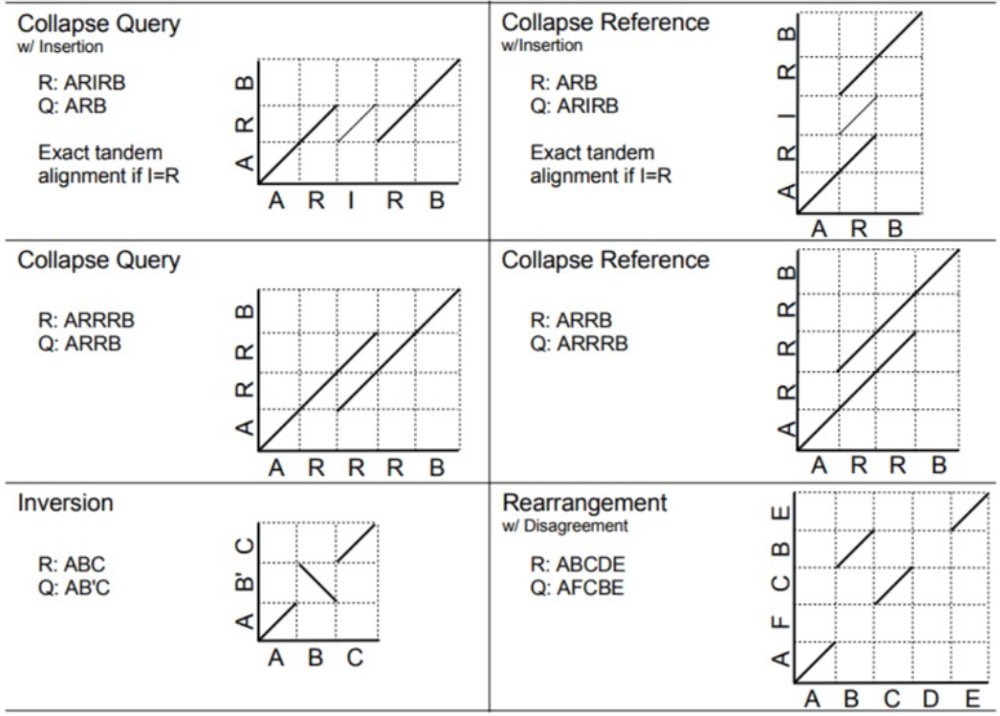

比较原始reads的k-mer和组装好的基因组中的k-mer是否存在差异，来判断组装是否错误。
